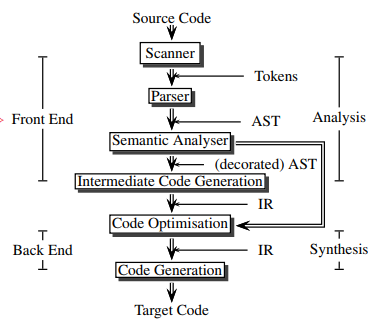
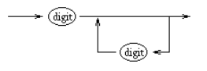
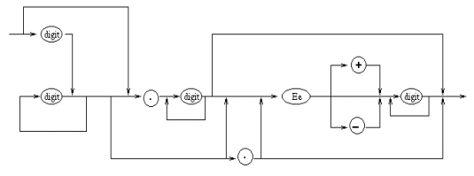

# COMP3131 - Week 1: Introduction and Lexical Analysis

## Administration
- Assignment every 2 weeks
- All assignments depend on the previous assignments

## Subject Overview
- Typical structure of a compiler  

- Components:
  - Lexical analysis
  - Syntax analysis
  - Semantic analysis
  - Intermediate code generation
  - Code optimisation
  - Code generation

## Lexical Analysis

### The role of a scanner

- **Tokens** to programming languages are like words to natural languages
- Scanner gets called by Parser when it needs a new token

### Tokens
- In VC, tokens are classified as follows:
  - Identifiers: `i`, `j`
  - Keywords: `int`, `if`, `while`
  - Operators: `+`, `*`, `<=`
  - Separators: `{`, `}`, `,`, `;`
  - Literals: integer, real, boolean, string constants
- Example of tokens in natural languages: verb, noun, article, adjective
- **Lexeme**: the spelling of a token

#### Token Patterns
- **Pattern**: a rule describing the set of lexemes that can represent a particular token
- Pattern need to match each string in the set

Token type|Pattern|Lexeme
---|---|---
INTLITERAL|A string of decimal digits|127, 0
FLOATLITERAL|digit* fraction exponent? \| digit+. \| digit+.?exponent|127.1, .1, 1.1e2
ID|a string of letters, digits and underscore|sum, line_num
+|the character '+'|+
while|the letters 'w', 'h', 'i', 'l', 'e'| while
- Finite State Machines
  - For Integer  
  
  - For Float  
  
- 2 Approaches to distinguish identifiers from reserved words:
  - The scanner interacts with the parser
  - Regard the identifiers and keywords as having the same token type, leaving the task of distinguishing them to the parser
- Scanner always returns the **longest possible match** in the remaining input
  - ie `>=`, not `>` and `=`
