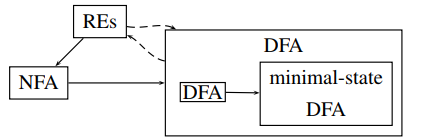
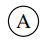
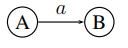
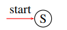
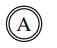
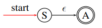
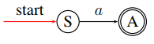
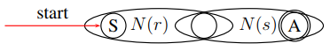
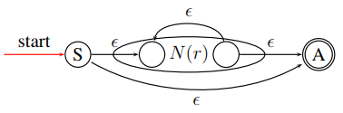

# COMP3131 - Week 2: REs, NFAs and DFAs

- The course only cover:
  - RE -> NFA
  - NFA -> DFA
  - DFA -> minimal-state DFA

## Definitions
- **Alphabet**: denoted Σ: any finite set of symbols
- **String**: a finite sequence of symbols drawn from Σ
  - Length |s| of string s: the number of symbols in s
  - ϵ: the empty string, |ϵ| = 0
- **Language**: any set of strings over Σ; with 2 special cases:
  - ∅: the empty set
  - {ϵ}
- **Part of a strings**
  - prefix of s: a string obtained by removing 0 or more trailing symbols of s
  - suffix of s: a string obtained by removing 0 or more leading symbols of s
  - substring of s: a string obtained by deleting a prefix and a suffix from s
  - **proper** prefix,suffix,substring of s: any nonempty string of the above
- **String concatenation**: if _x_ and _y_ are strings, _xy_ is the string formed by appending y to x
  - ϵ is the identity: `ϵx = xϵ = x`

### Operations on Languages
#### Union: `L ∪ M`
`L ∪ M = { s | s ∈ L or s ∈ M }`

#### Concatenation: `LM`
`LM = { st | s ∈ L and t ∈ M }`

#### Kleene Closure: `L*`
- 0 or more concatenation of L

`L* = ∪^{∞}_{i=0}Lⁱ = L⁰ ∪ L ∪ LL ∪ LLL...`  
where `L⁰ = {ϵ}`

#### Positive Closure: `L+`
- 1 or more concatenation of L

`L+ = ∪^{∞}_{i=1}Lⁱ = L ∪ LL ∪ LLL...`

### Regular Expressions
- **Inductive Base**:
  1. ϵ is a RE, denoting the RL {ϵ}
  2. a ∈ Σ is a RE, denoting the RL {a}
- **Inductive Step**: Suppose r and s are REs, denoting the RLs L(r) and L(s). Then:
  1. `(r)|(s)` is a RE, denoting the RL `L(r) ∪ L(s)`
  2. `(r)(s)` is a RE, denoting the RL `L(r)L(s)`
  3. `(r)*` is a RE, denoting the RL `L(r)*`
  `(r)` is a RE, denoting the RL `L(r)`
- **Precedence**
  - `*` has the highest
  - `concatenation` second highest
  - `|` lowest
- **Associativty**: all are left-assosiative
- **Shorthands**
  - `r+` = `rr*`
    - Denotes the language `(L(r))+`
    - Same precedence as `*`
  - `r?` = `r|ϵ`
    - Denotes the language `L(r) ∪ {ϵ}`

### Finite Automata (FSM)
- Consists of a 5-tuple: `(Σ, S, T, F, I)`
  - `Σ` - alphabet
  - `S` - finite set of states
  - `T` - state transition function: `T : S x Σ -> S `
  - `F` - finite set of **final** or **accepting** states
  - `I` - is the start state: `I ∈ S`
- **Representation**
  - State:
  
  - Transition:
  
  - Start state:
  
  - Final state:
  
- **Acceptance**: A FSM accepts an input string _x_ if and only if there is some path in the **transition fraph** from the start state to some accepting state such that the edge labels spell out _x_
- **Implicit error state**: the error state and transistions are not drawn

#### Deterministic FA (DFA) and Nondeterministic FA (NFA)
- A FA is a **DFA** if:
  - no state has an **ϵ-transistion**
  - for each state **s** and input symbol **a**, there is **at most one edge** labeled **a** leaving **s**
- A FA is a **NFA** if it is not a DFA:
  - **Nondeterministic**: can make several parallel transitions on a given input
  - **Acceptance**: the existence of some path

## REs -> NFA: Thompson's Construction of NFA from REs
- Inductive: the cases in the construction of the NFA follow the cases in the definition of REs
- Important: if a symbol _a_ occurs several times in a RE _r_, a separate NFA is constructed for each occurence

### Inductive Base
1. For `ϵ`, construct the NFA  

2. For `a ∈ S`, construct the NFA  

### Inductive Step
Suppose `N(r)` and `N(s)` are NFAs for REs `r` and `s`, then

#### RE `r|s`

#### RE `rs`

#### RE `r*`

#### RE `(r)`
Same as `r`

### RE `r+`
Prefix `r*`

## NFA -> DFA: Subset Construction
- DFA state corresponds to a subset of NFA state
- at most `2ⁿ` DFA states where `n` is the total number of the NFA states

### Operations
- **ϵ-closure(s)**
  - Set of NFA states readable from NFA state `s` on ϵ-transitions
- **ϵ-closure(T)**
  - Set of NFA states readable from some state `s` in `T` on ϵ-transitions
- **move(T, a)**
  - Set of NFA states to which there is a transition on input `a` from some state `s` in `T`
- Note:
  - `s`: a NFA state
  - `T`: a set of NFA states

### The Algorithm for Subset Construction
- Let `s₀` be the start state of the NFA
- `DFAstates` contains the only unmarked state ϵ-closure(s₀)
- while there is an unmarked state `T` in `DFAstates` do begin
  - mark `T`
  - for each input symbol `a`
    - `U` := ϵ-closure(move(`T`, `a`))
    - if `U` is not in `DFAstates` then
      - add `U` as an unmarked state in `DFAstates`
    - `DFATrans[T, a]` := `U`
  - end
- end

### The definition of the DFA
- Let `(Σ, S, T, F, s₀)` be the original NFA. The DFA is
  - The alphabet: `Σ`
  - The states: all states in `DFAstates`
  - The start state: ϵ-closure(s₀)
  - The accepting state: all states in `DFAstates` containing at least one accepting state in `F` of the NFA
  - THe transitions: `DFATrans`

## DFA -> minimal-state DFA: State Minimisation
### The Algorithm
- Initially, let Π be the partition with the two groups
  1. One is the set of all **final** states
  2. The other is the set of all non-final states
- Let Π_{new} = Π
- for (each group `G` in Π_{new})
  - partition G into subgroups such that two states `s` and `t` are in the same subgrup iff for all input symbols `a`, states `s` and `t` have transitions on `a` to states in the same group of Π_{new}
  - replace `G` in Π_{new} by the set of subgroups formed

#### Notes
- Begins with the most optimistic assumption
- **Theoritical Result**: every regular language can be recognised by a minimal-state DFA that is unique up to state names

## Limitations of REs or FAs
- Cannot count
- Cannot recognise palindromes
- The language of the balanced parentheses
  - `{ (ⁿ)ⁿ | n >= 1 }`
