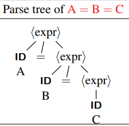
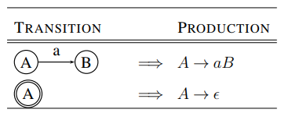
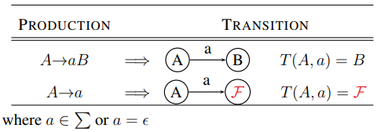

# COMP3131 - Week 3: Context-Free Grammars

## The syntax and semantics of a programming language
### Syntax
- The form or structure of a program and individual statements in the language
- No concern with the meaning of a program
- Specified by a CFG

### Semantics
#### Static Semantics
- Context-sensitive restrictions enforced at compile-time
- Example for violations:
  - Undeclared variables
  - Assignment incompatible
  - Operands with incompatible types
  - Wrong number of arguments

#### Run-time Semantics
- What the program does or computes
- The meaning of a program or what happens when it is executed
- Specified by code generation routines

## Specify a language's syntax: CFG, BNF, EBNF
### Why use grammars
- New language constructs can be added easily
- Allows language modifications and extensions
- Enable syntax-directed translation

### CFG: Formal definition
A grammar `G` is a quadruple (`Vₜ`, `Vₙ`, `S`, `P`)
- `Vₜ`: a finite set of terminal symbols or tokens
- `Vₙ`: a finiste set of nonterminal symbols (`Vₜ ∩ Vₙ = ∅`)
- `S`: a unique start symbol (`S ∈ N`)
- `P`: a finite set of rules or productions of the form `(A, α)` where
  - `A`: a nonterminal
  - `α`: a string of **zero** or more terminals and nonterminals. Zero means `α = ϵ` is possible

### BNF: Backus-Naur Form
- A notation for writing a CFG
- Each production `(A, α)` is written as: `A -> α`
  - The arrow means: "is defined to be", "derives"

### Derivations
A grammar **derives** sentences by
1. Beginning with the start symbol
2. Repeatedly replacing a nonterminal by the RHS of a production with that nonterminal on the LHS, until there are no more nonterminals to replace
- Such a **sequence** of replacements is called a **derivation** of the sentence being analysed
- The strings of terminals and nonterminals appearing in the various derivation steps are called **sentenial forms**
- A **sentence** is a **sentential form** with terminals only
- The **language**: the set of all sentences thus derived from the grammar

#### 2 types of useful derivations
- Depending on:
  - Which nonterminal to replace?
  - Which alternative to use for that nonterminal?
- **Leftmost derivation**: always replace the leftmost nonterminal
- **Rightmost derivation**: always replace the rightmost nonterminal

#### Notations and Conventions
- Start symbol: left side of the first production, and the letter `S`
- Nonterminals: lowe-case italic names, or Capital letters like `A`, `B`
- Terminals: **boldface**, lower case letters like `a`, `b`, digits and operators like `1`, `+`
- Strings of terminals: lower-case letters late in the alphabet like `u`, `v`, ... `z`
- Mixture of nonterminals and terminals: lower-case greek letters
- `->` : derivation in 1 step
- `->+` : derivation in one or more steps
- `->*` : derivation in zzero or more steps

## The parsing of a program in a language
- **Parsing**: A process of constructing the parse tree or leftmost/rightmost derivations for the sentence being analysed
- Use syntactic rules to break a sentence into its component parts and analyse their relationship
- **Parser**: a program that uses a CFG to parse a sentence or a program
  - Constructs its leftmost or rightmost derivation or
  - build the parse tree for the sentence
- **Recogniser**: a parser that checks only the syntax without having to built the parse tree. It outputs **yes** if the program is legal and **no** otherwise

### The role of a parser

- Performn context-free syntactic analysis
- Construct a tree (an AST)
- Produce some meaningful error messages
- Attempt error recovery

### The structure of parse trees
- Root: start symbol
- Nonterminals: interior nodes
- Terminals: leaves
- The sentence being analysed is the leaves read from left to right

## The structure of a grammar
### EBNF
- EBNF is BNF + RE
- Have `*`, `+`, `?`
- Convenient for writing recursive-descent parsers

#### Kleene Closure Example
Zero or more  
**BNF**
```
program   -> decl-list
decl-list -> decl-list func-decl
           | decl-list var-decl
           | ϵ
```

**EBNF**
```
program   -> (func-decl | var-decl)*
```

#### Positive Closure Example
One or more  
**BNF**
```
program   -> decl-list
decl-list -> decl-list func-decl
           | decl-list var-decl
           | func-decl
           | var-decl
```

**EBNF**
```
program   -> (func-decl | var-decl)+
```

### The classic expression grammar
```
expr   → expr + term
       | expr − term
       | term
term   → term ∗ factor
       | term / factor
       | factor
factor → ( expr )
       | ID
       | INT
```
- Left-recursive productions: A→Aα
- Right-recursive productions: A→αA
- Higher precedence operators appear lower in the tree, so it will be executed first
- Associativty: left-recursive productions enforce left-assosiativity
- Grammar with left-recursive productions:
  - `expr -> ID | expr - ID`  
  
- Grammar with right-recursive productions:
  - `expr -> ID | ID = expr`  
  

### Ambiguous Grammars
- A grammar is ambiguous if it permits
  - more than one parse tree for a sentence
  - more than one leftmost derivation or more than one rightmost derivation for a sentence
- Solutions:
  - Rewrite the grammar to make it unambiguous, or
  - Use disambiguating rules to throw away undesirable parse trees, leaving only one tree for each sentence

### Limitations of Regular Grammars
- Cannot generate nested constructs, the language `aⁿbⁿ` where n>=0
- Cannot count
- We use CFG in Parser because CSG is overkill and slow

### Limitations of CFG
- Can count 2 but not 3: `aⁿbⁿcⁿ` where n>=0

## The equivalence between regular grammars and finite Automata
### Converting NFAs to Right-Linear Grammars
- The alphabet: the same
- For each state in the NFA create a nonterminal with the same name
- The start state will be the start symbol  

- where `a ∈ Σ` or `a = ϵ`

### Converting Right-Linear grammars to NFAs
- The alphabet: the same
- For each nonterminal, create a state in the NFA with the same name
- The start symbol is the start state
- Add one new state, and make it the only final state `F`  

