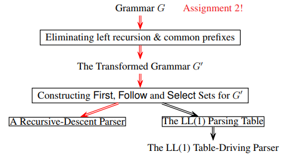
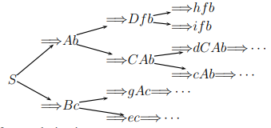

# COMP3131 - Week 4: Recursive-Descent Top-Down Parsing



## Top-Down Parsing
- Build the parse tree starting with the start symbol towards the sentence being analysed. ie from root to leaves
- Use one token of lookahead
- Discover the leftmost derivation
- **Predictive/Non-backtracking**: to expand a nonterminal, the parser always **predict** the right alternative for the nonterminal by looking at the lookahead symbol only
  - Prediction happens before the actual match begins

## First Sets
Example grammar:
```
S → Ab | Bc
A → Df | CA
B → gA | e
C → dC | c
D → h | i
```
Form the tree:  


- First(Ab) = {c, d, h, i}
- First(Bc) = {e, g}

### Definition
First(α):
- The set of all terminals that can begin any strings derived from α
- if α -> ϵ, then ϵ is also in First(α)
- A nonterminal A is **nullable** if A ->* ϵ

### Procedure to Compute
- Case 1: α is a single symbol or ϵ:
  - If α is a terminal a, then First(α) = First(a) = {a}
  - Else if α is ϵ, then First(α) = First(ϵ) = {ϵ}
  - Else if α is a nonterminal and α -> β1 | β2 | β3 |... then
    - First(α) = ∪ₖFirst(βₖ)
- Case 2: α = X₁X₂...Xₙ:
  - If X₁X₂...X_i is nullable but X_{i+1} is not, then
    - First(α) = First(X₁) ∪ First(X₂) ∪ · · · ∪ First(X_{i+1})
  - Add ϵ to First(α) if and only if α is nullable (everything is nullable)

### Expression Grammar without left recursion
```
E → T Q
Q → +T Q | − T Q | ϵ
T → F R
R → ∗F R | /F R | ϵ
F → INT | (E)
```

## Follow Sets
- First sets do not tell us when to apply A→α such that α -> \*ϵ but follow sets do
- Follow sets constructed only for **nonterminals**
- We assume every input is terminated by a special end marker, denoted `$`
- Follow sets do not contain ϵ

### Definition
Let A be a nonterminal. Define Follow(A) to be the set of terminals that can appear immediately to the right of A in some sentential form. That is,
- Follow(A) = { a | S ⇒∗ ...Aa... }
- where S is the start symbol of the grammar

### Procedure
- If A is the start symbol, add $ to Follow(A)
- Look through the grammar for all occurrences of A on the right productions. Let a typical production be
  - B -> αAβ
- There are 2 cases:
  - Follow(A) includes First(β) − {ϵ}
  - If β ⇒∗ϵ, then include Follow(β) in Follow(A)

## Select Sets
- One Select set for every production in the grammar
- The Select set for a production of the form A→α is:
  - If ϵ ∈ First(α), then
    - Select(A→α) = (First(α) - {ϵ}) ∪ Follow(A)
  - Otherwise:
    - Select(A→α) = First(α)
- The Select set predicts A→α to be used in a derivation
- Thus, the Select not needed if A has one alternative

## Top-Down Parsing
### Definitions for Terms
- **Predictive**: the parser always predicts the right production to use at every derivation step
- **Recursive**: a parsing method may call itself recursively either directly or indirectly
- **Descent**: the parser builds the parse tree by **descending** through it as it parses the program

### LL(1) Grammar
- A grammar is **LL(1)** if for every nonterminal of the form:
  - A → α1 | · · · | αn
- the select sets are pairwise disjoint ie
  - Select(A→αi) ∩ Select(A→αj ) = ∅
  - for all i and j such that i != j
- Implies there can be at most one **nullable** alternative
- A grammar with left recursion is not LL(1)
- LL(1) means it can be parsed deterministically using 1 token of lookahead
  - Input parsed from **L** eft to right
  - **L** eftmost derivation
  - **1** token of lookahead

## Eliminating Direct Left Recursion
### Grammar Rewriting
From
```
A → α // α does not begin with A
A → Aβ1 | Aβ2
```
To
```
A  → αA'
A' → β1A' | β2A' | ϵ
```

### Regular Operators
From
```
A → α
A → Aβ1 | Aβ2
```
To
```
A → α(β1 | β2)*
```

## Eliminating Common Prefixes
- Grammars with common prefixes are not LL(1)
  - Example: dangling-else grammar

### Left-Factoring
From
```
A → αβ1 | αβ2
A → γ
```
To
```
A  → αA'
A  → γ
A' → β1 | β2
```

### Choice Operator
From
```
A → αβ1 | αβ2
A → γ
```
To
```
A  → α(β1 | β2)
A  → γ
```
