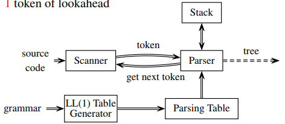
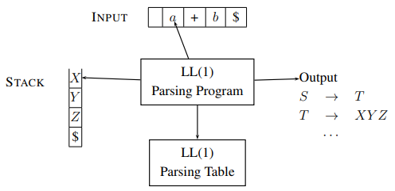
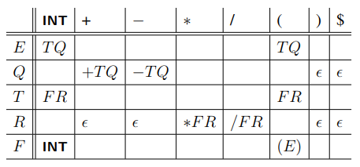

# COMP3131 - Week 5: Table-Driven LL(1) Top-Down Parsing

## Parsing Methods
### Top-Down parsing
- Build the parse tree top-down
- Starting with the start symbol (from root)
- Discover the leftmost derivation
- Productions used represent the leftmost derivation
- The best known and widely used methods:
  - Recursive descent
  - Table-driven
  - LL(k)

### Bottom-up parsing
- Build the parse tree bottom-up
- Starting with the sentence being analysed, towards the start symbol
- Discover the rightmost derivation in reverse
- Productions used represent the rightmost derivation in reverse
- The best known and widely used method: LR(1)
  - Left-to-right scan of input, rightmost derivation in revere, 1 token of lookahead
- More powerful

## LL(1) Table-Driven Parsing
- Recursion = Iteration + Stack
- Structure:  

- The model:  

- Need to construct the LL(1) parsing table after constructing the First, Follow, Select sets
- **Rules for constructing an LL(1) parsing table**:
  - For every production of the A→α in the grammar, do:
    - For all `a` in Select(A→α), set `Table[A, a] = α`
- Example table for the expression grammar:  

  - The blanks are errors
- Example LL(1) Parse on Input `i+i`  

- Table-driven LL(1) parsers can only parse LL(1) grammars
- A grammar is LL(1) if every table entry contains at most one production
