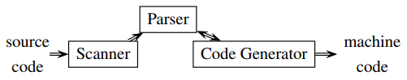
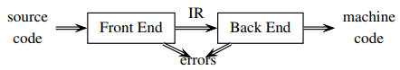
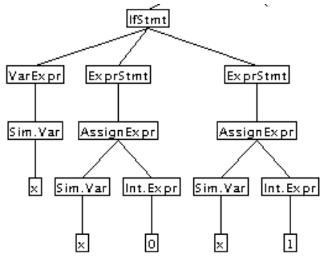
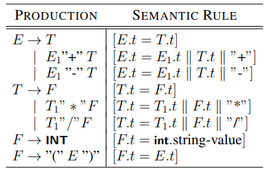

# COMP3131 - Week 6: Abstract Syntax Trees

## Physical Tree
### Passes
A pass:
1. Reads the source program or output from a previous pass
2. Makes some transformations
3. Then writes output to a file or an internal data structure
- In the past a pass is the process of reading a file from the disk and writing a file to the disk.

### One-Pass Compilers
  
- Code generation done as soon as a construct is recognised
- Easy to implement, code inefficient because no optimisations

### Two-Pass Compilers

- Why IR?
  - To simplify retargeting, and sophisticated optimisations
  - Can optimise program in multiple passes

### Physical Tree
- Tree is one intermediate Representation (IR)
  - The syntactic structure represented explicit
  - The semantics attached to the nodes

## Parse Trees vs Syntax Trees
### Phrases
- A phrase of a grammar G is a string of terminals labelling the terminal nodes (from left to right) of a parse tree
- An `A-phrase` of G is a string of terminals labelling the terminal nodes of the subtree whose root is labelled A
- Example: an if-phrase has: an expression, and 2 statements  

### Parse Trees (or Concrete Syntax Trees)
- Specifies the **syntactic structure** of the input
- The underlying grammar is a **concrete syntax** for the language
- Used for parsing, to decide if a sentence is syntactically legal
- Has one leaf for every token in the input and one interior node for every production used during the parse

### Syntax Trees (or Abstract Syntax Trees)
- Specifies the **phrase structure** of the input
- More compressed than parse tree:
  - Nonterminals used for defining operators precedence and associativity should be confined to the parsing phase
  - Separators (punctuation) tokens are redundant in later phases
  - Keywords implicit in tree nodes
- **Abstract syntax** can be specified using an **attribute grammar**
- Used in type checking, code optimisation and generation

### An Attribute Grammar for Converting Infix to Postfix

- `t`: a string-valued attribute
- `||`: string concatenation
