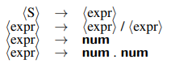
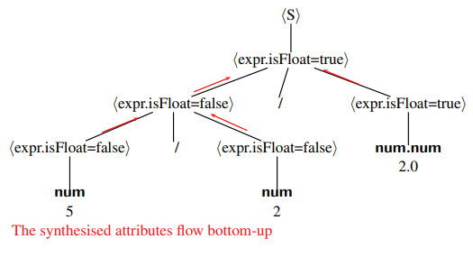
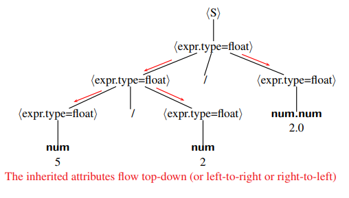
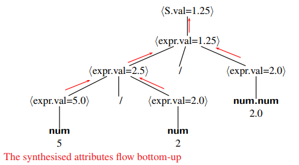

# COMP3131 - Week 7: Attribute Grammars

## Attribute Grammars
### Compiler Front End
After scanning and parsing:
- Semantic analysis enforces **static semantics**
  - Identification (symbol table)
  - Type checking
- Context-sensitive static semantics cannot be specified by a CFG
- An attribute grammar augments a CFG to complete the specification of what legal programs should look like
- **Context-sensitive Restriction** examples:
  - is `x` a variable, method, array, etc?
  - is `x` declared before used?
  - etc.
  - **can not be specified using CFG**

### Context-sensitive analysis (Semantic Analysis)
- Ad hoc techniques:
  - Symbol table and codes
  - "Action routines" in parser generators
- Formal methods:
  - Attribute grammars
  - Type systems and checking algorithms

### Attribute Grammars
- Generalisation of CFGs
- High-level spec, independent of any evaluation order
- Attributes computed from other attribute:
  - **Synthesised** attributes: computed from children
  - **Inherited** attributes: computed from parent and siblings
- Attribute can represent anything: string, number, type, etc
  - Has a name and type

### Formal Definition
- An attribute grammar is a triple: `A = (G, V, F)`
  - `G`: a CFG
  - `V`: a finite set of distinct attributes
  - `F`: a finite set of semantic rules (semantic computation and predicate) functions about the attributes
- Each attribute is associated with a grammar symbol
- Each semantic rule is associated with a production that makes reference only to the attributes associated with the symbols in the production

#### Example attribute grammar
- The grammar  

- The attribute grammar  

  - Like get the type from the other's type
  - **Synthesised** attribute `isFloat` over {true, false}
  - **Inherited** attribute `type` over {int, float}
  - **Synthesised** attribute `val` of the type int
  - `val` depends on `type`, which depends on `isFloat`
- The flow of Synthesised attribute `isFloat`  

- The flow of Inherited attribute `type`  

- The flow of Synthesised attribute `val`  

## Attributes: Formal Definition
- Let X_0 -> X1X2...Xn be a production and
- A(X) be the set of attributes associated with a grammar symbol X

### Synthesised Attributes
- A synthesised attribute, `syn` of X0 is computed by:
  - X0.syn = f(A(X1), A(X2), ... A(Xn))
- syn on a tree node depends on those on its children

### Inherited Attributes
- An inherited attribute, `inh` of Xi is computed by:
  - Xi.inh = g(A(X0), A(X1), ... A(Xn))
- inh on a tree node depends on those on its parent or siblings

## Attribute Evaluators
### Tree Walkers
- Traverse the parse or syntax tree in one pass or multiple passes at **compile time**
- Capable of evaluating any **noncircular** attribute grammar
- An attribute grammar is **circular** if an attribute depends on itself
- Can decide the circularity in exponential time
- Too complex to be used in practice

### Rule-Based Methods
- The compiler writer analyses the attribute grammar and fixes an evaluation order **at compiler-construction time**
- Trees can still be used for attribute evaluation
- Almost all reasonable grammars can be handled this way
- Used practically in all compilers

### Pre- vs Post-order visits
- **Pre-order visits**: propagate inherited attributes downwards
- **Post-order visits**: propagate synthesised attributes upwards

## Visitor Design Pattern
- Every concrete class `A` implements the visit method by simply calling the visitor method `visitA` in the interface
- The **visitor** contains operations that operate on data defined by other classes
- Each visit method at a node knows which particular visitor method to call

## L-Attributed Grammars
- **Motivation**: parsing and semantic analysis in one pass in top-down parsers (recursive descent and LL parsers)
- **Definition**: an attribute grammar is L-attributed if each inherited attribute of Xi, 1 <= i <= n, on the right hand side of X0 -> X1X2...Xm depends only on
  - The attributes of the symbol X1, X2, ... Xi-1 to the left of Xi in the production and
  - The inherited attributes of X0
- The **L**: information flowing from **left** to right
- Example 1 is not L-attributed, because in `S -> expr`, the inherited attribute `expr.type` depends on the synthesised attribute `expr.isFloat`
- **Evaluation**:
  - All attribute evaluated **in one pass**

## S-Attributed Grammars
- **Motivation**: parsing and semantic analysis in one pass in bottom-up parsers
- **Definition**: an attribute grammar is S-attributed if it uses synthesised attributes only
- The information always flow up in the tree
- Every S-attributed grammar is L-attributed
- Example is not S-attributed
