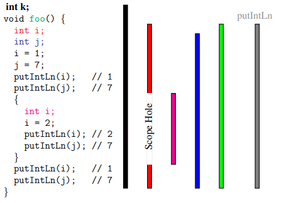

# COMP3131 - Week 8: Static Semantics

## Semantic Constraints
### Scope rules
- **Blocks**: a language construct that can contain declarations:
  - The compilation units
  - Procedures/functions
  - Compound statements
  - In VC: `{ ... }`
- The **scope** of a declaration is the portion of the program over which the declaration takes effect
- A declaration is in scope at a particular point in a program if and only if the declaration's scope includes that point
- **Scope rules**: the rules governing declarations (called defined occurrences of identifiers) and references to declarations (called applied occurences of identifiers)
- **Scope hole**: The gap when something re declared in the block  

- **Scope levels**
  - The declarations in the outermost block are in level 1
  - Increment the level by 1 everytime we move to an enclosed block

## Two subphases in semantic analysis
### Identification
- **Identification**: Relate each applied occurrence of an identifier to its declaration and report an error if no such a declaration exists
- **Symbol Table**: Associates identifiers with their attributes
- **The attributes of an identifier**: a variable or a function; the type in the former and the function's result type and the types of a function's formal parameter in the latter
- 2 approaches to representing the attributes in the table:
  - The information distilled from the declaration and typically stored in the symbol table or
  - A pointer to the declaration itself

### Type checking
- **Data type**: set of values plus set of operations on the values
- Typical checks:
  - Type checks: expressions well typed using the type rules
  - Flow-of-control checks: break & continue contained in a loop
  - Uniqueness checks: the labels in a switch are distinct
- **Type rules**: the rules to infer the type of each language construct and decide whether the construct has a valid type
- **Type checking**: applying the language's type rules to infer the type of each constsruct and comparing that type with the expected type
- **type** is a Synthesised attribute in VC
  - Bootom-up computation of type:
    - Literal: type is immediately known
    - Identifier: obtained from Decl
    - Binary operator application: look at the terms

#### Type Coercions
- The compiler **implicitly** converts int to float, whenever necessary, when an expression is evaluated

## Standard Environment
- Most languages contain a collection of predefined variables, types, functions and constants:
  - Java: java.lang
  - Haskell: prelude

## Error Detection, Reporting and Recovery
- **Detection**: based on type rules
- **Reporting**: prints meaningful error messages
- **Recovery**: continue checking types in the presence of errors
