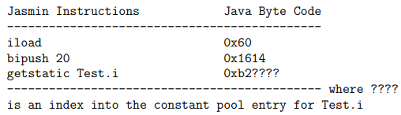
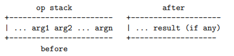
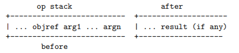

# COMP3131 - Week 9: Jasmin Assembly Language

## Jasmin vs Java Byte Code
- 1-to-1 correspondence
  - Operation codes represented by mnemonics
  - Name indices written in symbolic form
  - Local variables are encoded by indices
- Example:  

## JVM
### Data Types
Type|Range|Field Desc
---|---|---
boolean|{0,1}|Z
byte|8 bit 2C|B
short|16 bit 2C|S
int|32 bit 2C|I
long|64 bit 2C|L
char|16 bit unsigned Unicode|C
float|32 bit IEEE 754 single-precision|F
double|64-bit IEEE 754 double-precision|D
reference|32 bit unsigned reference|
returnAddress|32 bit  unsigned reference|
class reference|-|Lclass-name;
interface reference|-|Linterface-name
array reference|-|[[...[component-type
void|-|V

2C = signed 2's complement
- Boolean, byte, char, short are all implemented as int, but arrays of these types may be stored in arrays of less than 32 bits

### Method Descriptors
- Format: `(ParameterType*)ReturnType`
- Example:

Method declaration|Descriptor
---|---
`int gcd(int i, int j)`|`(II)I`
`void main(String argv[])`|`([Ljava/lang/String;)V`

### Operand Stack
- Accessed by pushing and popping values
  - Storing operands and receiving the operations' results
  - Passing arguments and receiving method results
  - This unified view is one of the main reasons why code generation for stack-based machines is easier than registers-based machines
- A **new** op stack is created every time a method is called

### Local Variable Array
- A **new** local variable array is created each time a method is called
- Local variables addressed by indexing, starting from 0
- **Instance methods**: normal method, `this` is given to index 0
  - slot 0 given to **this**
  - Parameters (if any) given **consecutive** indices, starting from 1
  - The indices allocated to the other variables in any order
- **Class methods**: `static` method
  - Paramters (if any) given **consencutive** indices, starting from 0
  - The indices allocated to the other variables in any other
- One slot can hold a value of boolean, byte, etc
- One pair of slots for long and double

### Jasmin instructions
- Arithmetic instructions: add: `iadd`, `fadd`, etc, comparison: `fcmpg`, `fcmpl`
- Load and store instructions: `iload_0`, `iload_3`, `iaload`, `istore_0`, `iconst_0`, etc
- Control transfer instructions: `goto`, `ifeq`, `ifne`, etc
  - `if_icmge`: Pop off 2 ints from opstack and compare them. If value1 >= value2, jump to label. Otherwise execution continues at the next instruction
- Type convertion instructions: `i2f`, `i2c`, `f2i`, etc
- Operand stack management instructions:
  - `dup`: duplicate stack top
  - `pop`: remove stack top
  - `swap`: swap the top 2 operands
- Object creation and manipulation
  - create a new class instance: `new`
  - access fields of classes: `getstatic`, `putstatic`, `getfield`, `putfield`
  - create new array: `newarray`
  - Load an array componend: `iaload`, `faload`
  - Store a value from the opstack to array: `iastore`
- Method invocation instructions
  - method calls: `invokestatic`, `invokevirtual`, `invokespecial`
  - method returns: `return`, `ireturn`

#### `invokestatic`

#### `invokevirtual` and `invokespecial`

### Jasmin Directives
`.source`, `.class`, `.super`, `.limit`, `.method`, etc
