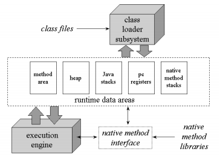
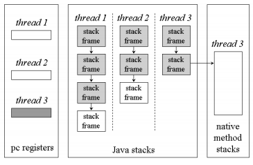

# COMP3131 - Week 11: Java Class File Format & Runtime Areas

## Lvalue vs Rvalue
- lvalue: reference
- rvalue: value

## Java Runtime Areas
- pc registers
- Java stacks (due to multi-threading) - one per thread
  - Local variables
  - Operand stack
  - Frame data
    - pointer to constant pool
    - information about method return
- Method area - contains class data
- Heap - contains objects
- Internal architecture of JVM  

- Java stacks  

- **Stack Frame**: created for every method invocation
