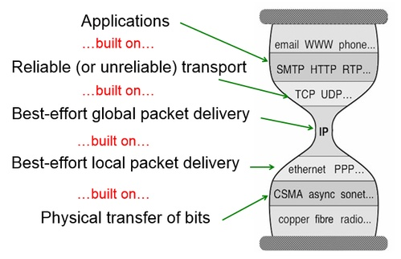
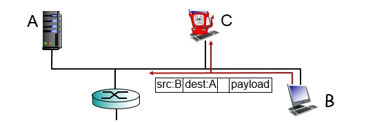
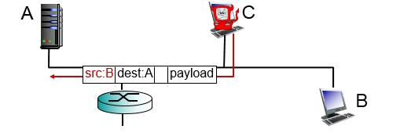

# COMP3331 - Topic 1: Introduction

## 1.1 What is the internet?
**Nuts and bolts view**
- Millions of connected computing device
- Communication links
- Packet switches

The Internet is a "network of networks", of interconnected Internet Service Providers (ISPs).  
We need a protocols of sending and receiving messages. Some examples are TCP, IP, HTTP, etc.  
Internet standards: Request for comments (RFC), Internet Engineering Task Force (IETF).

**A service view**
- Infrastructure that provides services to applications: Web, VoIP, email, games, etc
- Provides programming interface to applications:
  - Hooks that allow sending and receiving app programs to "connect" to the Internet
  - Provides service options, analogous to postal service

### What's a protocol?
Protocols define format, order of messages sent and received among network entities, and actions taken on message transmission, receipt.
- TCP connection request ->
- <- TCP connection response
- Get [webpage] ->
- <- [file]

**Protocol standardization**  
Standardized protocols are public, the protocol specification are public. Example: HTTP.

## 1.2 Network edge
### High level view of the Internet
- Network edge
  - Hosts: clients and servers
  - Servers often in data centers
- Access network, physical media
  - Wired, wireless communication links
- Network core
  - Interconnected routers
  - Network of networks

**Q: How to connect end systems to edge router?**  
Using:
- Residential access networks
- Institutional access networks (school, company)
- Mobile access networks  

We also need to keep in mind of:
- How much is the bandwidth (bits per second) of access network?
- Is the network shared or dedicated?

### Different types of access networks
1. Digital Subscriber Line (DSL)
  - Use existing telephone line to central office DSLAM
    - Data over DSL phone line goes to Internet
    - Voice over DSL phone line goes to telephone net
  - < 2.5 Mbps upstream transmission rate
  - < 24 Mbps downstream transmission rate
2. Cable network
  - Using cable television company's existing infrastructure
  - Frequency division multiplexint: different channels transmitted in diffrent frequency bands
  - HFC: Hybrid Fiber Coax
    - Assymetric: up to 30 Mbps downstream transmission rate, 2 Mbps upstream transmission rate
  - Network of cable, fiber attaches hoomes to ISP router
    - Homes share access network to cable headend
    - Unlike DSL, which has dedicated access to central office
3. Fiber to the home (FTTH)
  - Fully optical fiber path all the way to the home
    - Example: Verizon FIOS, Google, NBN
    - ~30 Mbps to 1 Gbps
  - Active (like switched Ethernet) or passive optical
4. Access net: home network
  - Home network made up of wireless devices, and then wireless access point, wired Ethernet, router, firewall, cable or DSL modem
5. Enterprise access networks (Ethernet)
  - Typically used in companies, universities, etc.
  - 10 Mbps, 100 Mbps, 1 Gbps, 10 Gbps transmission rates
  - Today, end systems typically connect into Ethernet switch
6. Wireless access networks
  - Shared wireless access network connects end system to router, via base station aka "access point"
    - Wireless LAN:
      - Within building
      - 802.11 b/g/n/ac (WiFi): 11, 54, 450 Mbps transmission rate
    - Wide-area wireless access
      - Provided by telco (cellular) operator, 10's km
      - Between 1 and 10 Mbps
      - 3G, 4G: LTE

### Different types of physical media
- Bit: propagates between transmitter/receiver pairs
- Physical link: what lies between transmitter & receiver
- Guided media: signals propagate in solid media, eg. copper, fiber, coax
- Unguided media: signals propagate freely, eg. radio  

**Types of physical media**
- Twisted Pair (TP)
  - Two insulated copper wires
    - Category 5: 100 Mbps, 1 Gbps Eethernet
    - Category 6: 10 Gbps
- Coaxial cable
  - Two concentric copper conductors
  - Broadband: multiple channels on cable, HFC
- Fiber optic cable
  - Glass fiber carrying light pulses, each pulse a bits
  - High-speed operation
    - High-speed point-to-point transmission
  - Low error rate
    - Repeaters spaced far apart
    - Immune to electromagnetic noise
- Radio
  - Signal carried in electromagnetic spectrum, ie. no physical wires
  - Propagation environment effects: reflection, obstruction by objects, interference
  - Radio link types:
    - Terrestrial microwave - up to 45 Mbps channels
    - LAN (eg. WiFi) - 11, 54, 450 Mbps
    - Satellite - Kbps to 45 Mbps, 270 msec end-end delay, geosynchronous versus low earth-orbiting (LEO)

## 1.3 Network core
- The network core is a mesh of interconnected routers/switches
- Two forms of switched networks:
  - Circuit switching: used in the legacy telephone networks
  - Packet switching: used in the Internet

### Circuit switching
**The idea**: to establish a circuit through the network.  
End to end resources allocated to, reserved for "call" between source and destination. Each path in the circuit will need to reserve the bandwidth as requested by the source.
- Each call get a dedicated link
- Dedicated resources: no sharing. Circuit-like (guaranteed) performance
- Circuit segment idle if not used by call
- Commonly used in traditional telephone networks

**Pros**:
- Uninterrupted connection
- Potentially faster, depending on how much you reserve

**Cons**:
- No sharing
- Delay time to establish end-end connection

**Multiplexing**: a method by which multiple analog or digital signals are combined into one signal over a shared medium. The aim is to share a scarce resource.
#### Frequency-Division Multiplexing (FDM)
- Break data up into multiple frequency bands and then allocate one band to each user.
- Each user transmits for the entire time within his allocated band.
- Size of the band may be equally split or depend on the request.

#### Time-Division Multiplexing (TDM)
- Multiplexing based on time, creates frames with slots.
- One slot is given to one user, and the user is allowed to use the entire band within the allocated time.
- Similar to round robin in a way

Both of these methods achieve the same ouput in a long time

#### Timing in circuit switching
Timing Diagram: vertical axis is time and horizontal axis is actual network.  
- Circuit request
  - The first thing that happen. The first switch checks if there is enough free bandwidth for this request. If yes, it will pass the request to the next switch. The process repeats until the request reaches the final destination.
- Delay
  - There will be delay at each switch, mainly due to the minor processing it does to make sure it can do reservation for the received packet. Finally an acknowledgement goes back confirming the circuit establishment.
  - No additional delay as the acknowledgement is sent back straight away.
  - Now the circuit is established between source and destination.
- Data transmission
  - Data is transmitted between source and destination.

### Packet switching
Data is sent as chunks of formatted bits (called **packet**). A packet consist of a **header** and **payload**.  
**Header**: contains some information that allows switches to forward the packet to the destination.  
**Payload**: the data inside the packet.  
Nothing is reserved in switches, data is instead broken up as packets.

**Pros**:
- Using the network effectively
- No wasted bandwidth
- Allows more users to use the network
- Great for bursty data
  - Resource sharing
  - Simpler, no call set up

**Cons**:
- Packet loss due to excessive congestion
- Packet delay (also due to excessive congestion)

#### How does packet switching work?
- Data is first divided into packets.
- Switches "forward" packets based on their header
  - The switches forward packets on a packet-by-packet basis, there is no concept of connection.
  - The switches treat the packets individually and decide where each packet should be sent and then send the packet on that link.
- Each packet travels independently, no notion of packets belonging to a "circuit"
  - So for example if you are sending more than one packets, they might go through different paths.
- No link resources are reserved in advance. Instead packet switching leverages ***statistical multiplexing***
  - Use all links capacity on a need-by-need basis.
  - **Statistical multiplexing**: share resources based on needs.

#### Timing in packet switching
- Time to process the packet at the switch is relatively negligible.
- **Cut through** switching: start transmitting as soon as the switch processed the header.
- **Store and forward** switching: assume that the swtich processes/forwards a packet after it has received it entirely.

```
N = number of routers
k = number of packets
P = size of packet in bits
T = time
d = propagation delay
```

**Message switching**: Transmit the data as one large chunk.  
```math
Total delay = Nt_{prop} + NT = Nt_{prop} + N(kP)
```
**Packet switching**  
```math
Total delay = Nt_{prop} + NP + (k-1)P
```

### Internet structure: Network of networks
- End systems connect to Internet via access ISPs.
- Access ISPs, in turn, must be interconnected.
- The resulting network of networks is very complex.

So the structure is loosely like this:
- At the center: a small number of well-connected large networks
  - Tier 1 commercial ISPs: eg. Sprint
  - Content provider network: eg. Google

## 1.4 Delay, loss, throughput in networks
```
d_{nodal} = d_{proc} + d_{queue} + d_{trans} + d_{prop}
```
4 sources of packet delay:
1. Nodal processing delay
  - Check bit errors
  - Determine output link
  - Typically less than msec
2. Queueing delay
  - Time waiting at output link for transmission
  - Depends on congestion level of router
3. Transmission delay
  ```
  d_{trans} = L / R
  ```
  - L: packet length (bits)
  - R: link bandwidth (bps)
4. Propagation delay
  ```
  d_{prop} = d / s
  ```
  - d: length of physical link
  - s: propagation speed in medium (~2 X 10^8 m/sec)

### Queueing delay
```
Traffic intensity = aL / R

a = packets/second = R/L
L = packet length
R = Link bandwidth, bits/second
```
- Every second, aL bits arrive to queue
- Every second, R bits leave the router
- When aL > R, the queue will fill up and packets will get dropped

#### Behaviour
- La/R ~ 0
  - Average queueing delay is small
- La/R -> 0
  - Delays become large
- La/R > 1
  - More work than can be serviced, average delay is infinite

#### `Traceroute`
Provides delay measurement from source to router along end-end Internet path towards destination
- Sends 3 packets that will reach router ***i*** on path towards destination
- Router ***i*** will return packets to sender
- Sender times interval between transmission and reply

### Packet loss
- Queue preceding link in buffer has finite capacity
- Packet arriving to full queue will be dropped
- Lost packet may be retransmitted by previous node, by source end system, or not at all

### Throughput
Rate (bits/time unit) at which bits transferred between sender/receiver.
- **Instantaneous**: Rate at given point in time
- **Average**: Rate over longer period of time

## 1.5 Protocol layers, service models
3 (networking) design steps
1. Break down the problem into tasks
2. Organize these tasks
3. Decide who does What

Tasks in Networking (bottom up)
- Bits on wire
- Packets on wire
- Deliver packets within local network
- Deliver packets across global network
- Ensure that packets get to the desstination
- Do something with the data

### The layered architecture of the Internet

- Applications: email, WWW, phone
- Reliable transport: SMTP, HTTP, RTP
- Best-effort global packet delivery: IP
- Best-effort local packet delivery: ethernet, PPP
- Physical transfer of bits: CSMA, async, sonet

### 5 Layers of Internet
- Application layer
- Transport layer
- Network layer
- Datalink layer
- Physical layer

**Pros of layering**

**Cons of layering**

### Internet Protocol stack

## 1.6 Networks under attack: security

- Internet not originally designed with much security in mind
- Bad guys: put malware into hosts
  - Virus and worm
  - Spyware can record keystrokes, browsing history, upload info
- Bad guys: attack server, network in infrastructure
  - Denial of Service (DoS): overwhelms resource with bogus traffic
- Bad guys: sniff packets

- Bad guys: fake address (IP spoofing)


## 1.7 History
- 1961-1972: Early packet-switching principles
- 1972-1980: Internetworking, new and proprietary nets
- 1980-1990: new protocols, a proliferation of networks
- 1990-2000: commercialization, the Web, new apps
- Late 2000's: Viral

