# COMP3331 - Topic 3: Transport Layer

## 3.1 Transport-layer Services
### Perspective
- Application layer is on top, need to provide reliability to them
- Executing in the OS kernel
- Network layer is below, and it can't guarantee reliability

### Transport Services and Protocols
- Provide logical communication between **app processes** on different hosts
  - This means the apps do not need to know how they are connected, the important thing is that they are connected and can share messages
- Transport protocols run on end systems
  - Sender: breaks messages from application layer into segments, pass it to network layer
  - Receiver: reassembles segments into messages, pass it to app layer
- Export services to application that network layer does not provide
- (Network layer provides logical communicaation between **hosts**)

### Why a transport layer?
- Each host has applications running on them, without transport layer the host would not know to which application should the packet be delivered.
- Transport layer makes sure that each applications' packets are delivered to the proper application on the destination side    
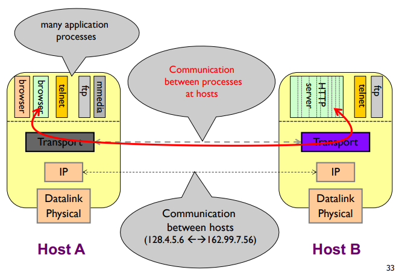

### Services we *might* provide at transport layer
- Reliable transfer: any data sent from the sending side is guaranteed to reach the destination
- Error detection: any errors that might creep up in the messages is detectable
- Encryption
- Message ordering: if message A was sent before message B, message A will be received before message B

## 3.2 Multiplexing and demultiplexing
- **Multiplexing**: a method by which multiple analog or digital signals are combined into one signal over a shared medium
- The network is a shared resource
- Multiplexing at sender: handle data from multiple sockets, **add transport header** (so we can demultiplex)
- Demultiplexing at receiver: use header info to deliver received segments to correct socket
- Demultiplexing:
  - The host uses IP address and port number to direct segment to the appropriate socket

### Connectionless Demultiplexing
- Every port number is an identifier
- When creating datagram to send into UDP socket, we need to specify the IP address and port number
- When host receives UDP segment:
  - Checks destination port number in segment
  - Direct the UDP segment to the socket with that port

### Connection-oriented Demultiplexing
- TCP Socket identified by 4-tuple:
  - Souce IP address
  - Source port number
  - Destination IP address
  - Destination port number
- Receiver will use all 4 values to direct segment to the appropriate socket
- Server host may support many simultaneous TCP sockets
- Web server has different sockets for each connecting client
  - **non-persistent** HTTP will have different socket for each request

### Scanning Ports
- Server wait at open ports for client request
- Hackers often perform port scans to determine open, closed, and unreachable ports on candidate victims
- How to can scan ports: nmap, superscan, etc

## 3.3 Connectionless Transport: User Datagram Protocol (UDP)
- "Best effort" service, UDP segments may be:
  - Loss
  - Delivered out of order to app
- Connectionless:
  - No handshaking between sender, receiver
  - Each UDP segment handled independently of others

### Why is there UDP?
- No connection establishment, less delay
- Simple, no connection state is maintained
- UDP header is small in size
- UDP has no congestion control

### UDP Segment Header
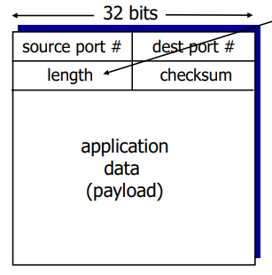

### UDP Checksum
- Goal: detect errors in transmitted segment
  - Router memory errors
  - Driver bugs
  - Electromagnetic Interference
- Sender:
  - Treat segment contents, including header as sequence of 16-bit integers
  - **Checksum** is the addition (1's complement sum) of segment contents
  - Sender puts checksum value into UDP checksum field
- Receiver:
  - Add all the received segments together as sequence of 16-bit integers
  - Add that to the checksum
  - If the result is not 1111 1111 1111 1111, there are errors
- **Wrap around**: most significant bit overflow needs to be added to the results

### UDP Applications
- Latency sensitive/time critical:
  - Quick request/response
  - Network management
  - Routing updates
  - Voice/video chat
  - Gaming (especially FPS)
- When error correction is unnecessary

## 3.4 Principles of reliable data transfer
- What can go wrong in data transfer?
  - A packet is corrupted
  - A packet is lost
  - A packet is delayed (because of queueing)
  - Packets are reordered
  - A packet is duplicated
- Transport layer gives an illusion that it's reliable (to application layer)  
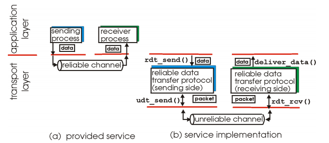

### RDT 1.0: Reliable transfer over reliable channel
- Channel: no bit errors, no packet loss
- Transport layer just send and read data from the underlying channel  
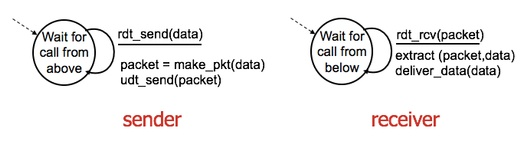

### RDT 2.0: Channel with bit errors
- Assume the underlying channel can only flip bits, but not drop them
- A checksum can be used to detect bit errors
- How to recover from errors?
  - Acknowledgement (ACK): Receiver explicitly tells the sender packet was completely received
  - Negative acknowledgement (NAK): Receiver explicitly tells the sender that packet is received with errors
    - Sender retransmit packets on receipt of NAK
- New mechanism:
  - Error detection
  - Feedback: Control messages (ACK, NAK)
- Fatal flaw:
  - If ACK/NAK is corrupted
    - Sender does not know what happen at receiver
    - Can not just retransmit because possible duplicate
  - Handling duplicate
    - Sender retransmit current packet if ACK/NAK corrupted
    - Sender adds sequence number to each packet
    - Receiver discards duplicate packet
- Stop and wait:
  - Sender sends one packet, then wait for response from receiver

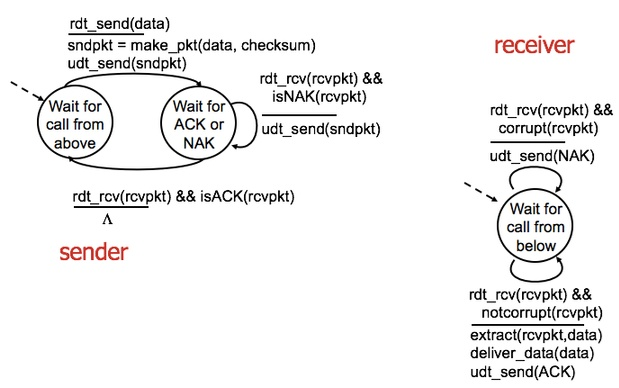

### RDT 2.1: Sender/receiver Handles Garbled ACK/NAKs
- Sender:
  - Add sequence number to packet
  - Two sequence packet (0, 1) is enough because we have stop-and-wait
  - Must check if received ACK/NAK corrupted
  - Twice as many states
  - State must "remember" whether "expected" packet should have sequence number of 0 or 1
- Receiver:
  - Must check if received packet is duplicate
  - State indicates whether 0 or 1 is expected packet sequence number
  - Note: the receiver can not know if its last ACK/NAK is received by the sender

### RDT 2.2: A NAK free protocol
- Like RDT 2.1, but does not send NAK, only send ACK of last packet successfuly received
- Receiver needs to explicitly tell the sequence number of the packet ACKed
- Duplicate ACK results in the same action as NAK

### RDT 3.0: Channels with errors and loss
- New assumption: underlying channel can also lose packets
- Approach: sender waits for a "reasonable" amount of time for ACK (timeout)
  - Retransmit if no ACK received during this time
  - If packet was just delayed
    - Retransmission will be duplicate, but will be handled with the sequence number
    - Receiver must specify the sequence number of packet being ACKed
  - Requires a countdown timer

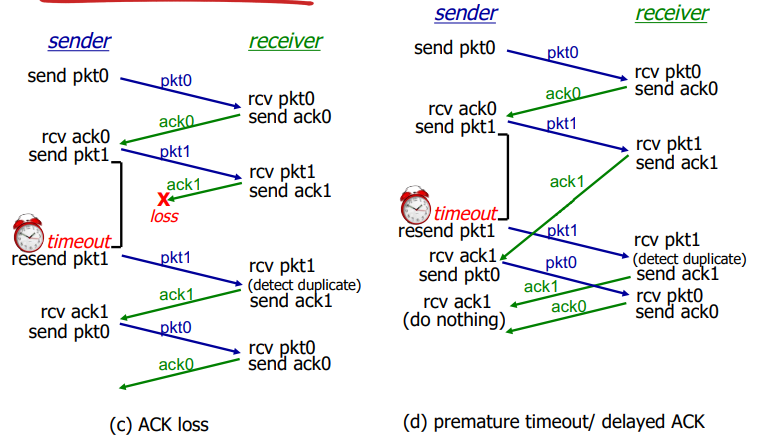

#### RDT 3.0: stop-and-wait
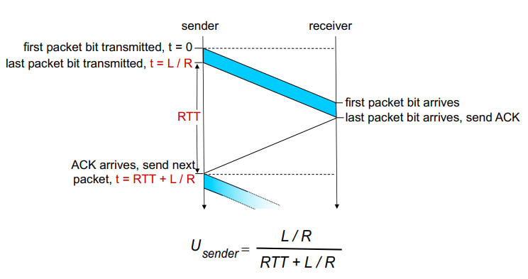

### Pipelined Protocols
- **Pipelining**: sender allows multiple "in-flight" not yet acknowledged packets
  - Range of sequence number needs to be increased
  - Buffering at sender or receiver
- 2 generic form of pipelined (sliding window) protocol:
  - Go-back-N
  - Selective repeat
- Pipelining increases utilization

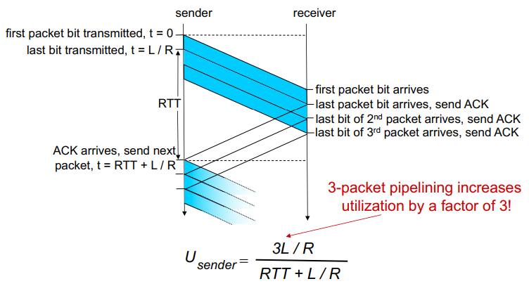

#### Go-back-N
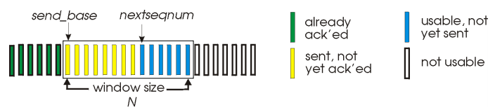
- Sender
  - "window" of up to N packets not yet ACKed
  - ACK(n): ACKs all packets up to and including sequence number n
  - Timer for oldest in-flight packet
  - timeout(n): retransmit packet n and all higher sequence number packets in the window
- Receiver
  - Only sends ACK of the highest sequence number correctly received
    - May generate duplicate ACK
  - Out-of-order packet will be discarded, no buffering
    - re-ACK with the highest sequence number correctly received

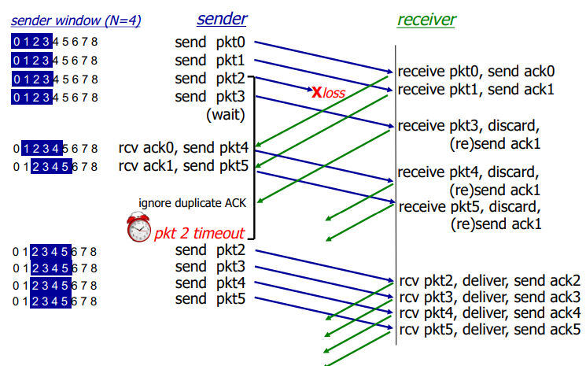

#### Selective repeat
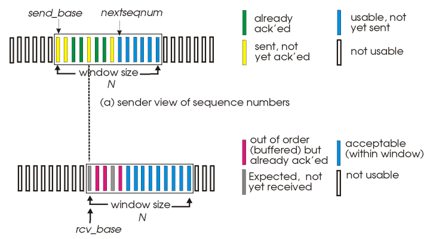
- Sender
  - Sends data from above: if the next available sequence number in window, send packet
  - timeout(n): resend packet n, restart its timer
  - ACK(n): mark packet as received.
    - If n is the smallest unACKed packet in the window, then slides the window
- Receiver
  - Individually acknowledged all correctly received packets
  - If packet is out of order, buffer
  - If packet in-order, deliver to upper layer
- Relationship between sequence number size and window size
  - **window size <= 1/2 sequence number size**

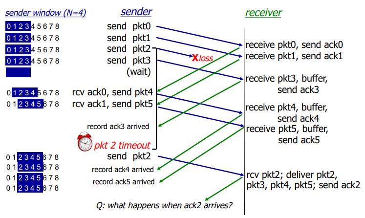

### Recap: Components of a solution
- Checksums - for error detection
- Timers - for loss detection
- Acknowledgement - cumulative and selective
- Sequence numbers - for duplicates and windows
- Sliding window - for efficiency

## 3.5 Connection-oriented transport: TCP
### TCP Overview
- Point-to-point - means it always has one sender and one receiver (logical)
- Reliable, in-order byte stream - no "message boundaries"
- Pipelined - TCP congestion and flow control set window size
- Sender and receiver have buffers
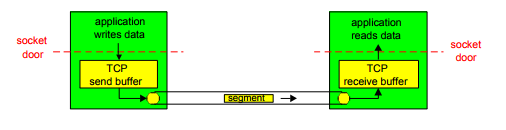
- Full duplex data
  - Bi-directional data flow in the same connection
  - MSS: Maximum Segment Size
- Connection oriented
  - Handshaking initalise sender and receiver state before data exchange
- Flow controlled
  - Sender will not overwhelm receiver

### TCP Segment Structure
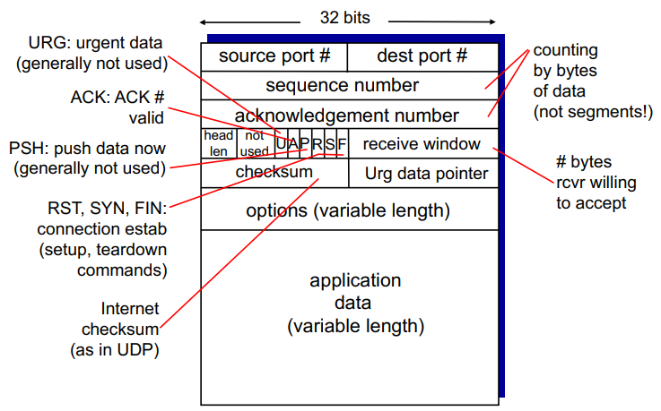
- Header is now 20 Bytes (UDP was 8 bytes)
- TCP segment size  
  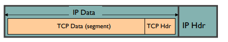
  - IP packet is no bigger than Maximum Transmission Unit (MTU) 1500 bytes
  - IP packet contains a TCP packet inside
  - TCP segment should be no more than MSS
  - MSS = MTU - (IP header) - (TCP header)

### Reliable data transfer
#### 1. Checksum
  - TCP checksum is similar to UDP checksum

#### 2. Sequence numbers and byte offsets
  - The sequence numbers are byte in the data
  - ISN = Initial Sequence Number, just randomly generated at the beginning
  

#### 3. Receiver sends cumulative acknowledgement (like GBN)
  - Sender sends packet, data start with sequence number X, and ends with X+B-1 where B is size
  - Receiver sends ACK with X+B, since it is the next expected byte

##### Piggybacking
- Both sides of the connection send some data
- Piggybacking enables both sides to communicate with each other

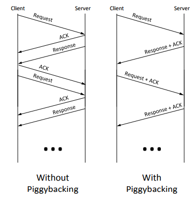

#### 4. Receiver can buffer out-of-sequence packets (like SR)
  - So receiver will send ACK of the "same" expected sequence number

#### 5. Sender maintains a single retransmission timer (like GBN) and retransmit on timeout
  - TCP RTT and timeout
    - TCP timeout value should be longer than RTT
    - If it is too short, premature timeout, unnecessary transmission
    - If too long, slow reacton to segment loss and connection has lower throughput
  - Estimating RTT
    - SampleRTT: measured time from segment transmission until ACK receipt  
    - EstimatedRTT: measured from SampleRTT  
    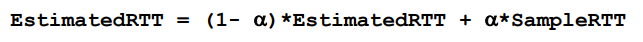
    - Exponential weighted moving average
    - Typical value for α = 0.125
    - Estimate the SampleRTT deviation  
    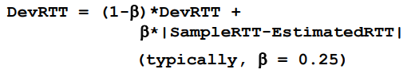
    - **Timeout interval** is EstimatedRTT with the safety margin  
    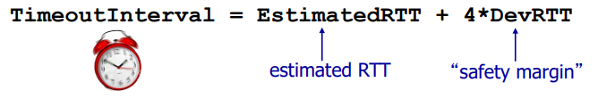
    - Exclude retransmission in the calculation

#### 6. Introduces fast retransmit
- If sender receives 3 duplicate ACKs for the same data, retransmit

#### TCP Retransmission Scenarios
- Lost ACK
  - The ACK is lost and the sender would eventually timeout, and send the packet again
- Premature timeout
  - The ACK come back after timeout
  - Will retransmit but receiver will just discards
- Cumulative ACK
  - Two packets sent back to back, the first ACK is lost but the second ACK received
  - TCP uses cumulative ACK, so that means the first packet is received

### Flow control
- Receiver controls the sender, so sender would not overflow receiver's buffer by transmitting too much, too fast
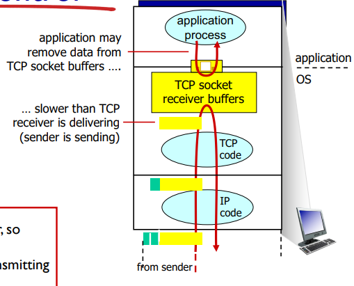
- Receiver advertises free buffer space by including **rwnd** value in the TCP header of receiver-to-sender segments
  - **RcvBuffer** size set via socket options
- Sender limits the amount of unACKed data to **rwnd**
- Sender probing by sending 0 byte when it buffer is full

### Connection management
- Before exchanging data, sender/receiver "handshake"
  - Agree to establish connection
  - Agree on connection parameters
- Initial Sequence Number (ISN)
  - Not just use 0 for ISN for security reasons (prevent man in the middle attack)
  - Need to get a new ISN for each connection
- **Establishing connection**: TCP 3-way handshake  
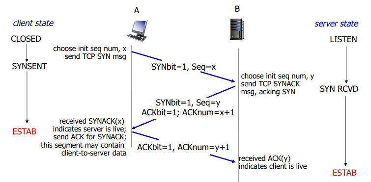
  - If SYN or ACK got lost, TCP sender waits for 3 seconds before resending SYN
  - In SYN loss in web downloads, usually the user will trigger the retransmission by clicking the link again
- **Closing connection**  
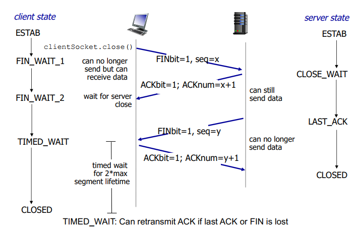

### TCP Finite State Machine
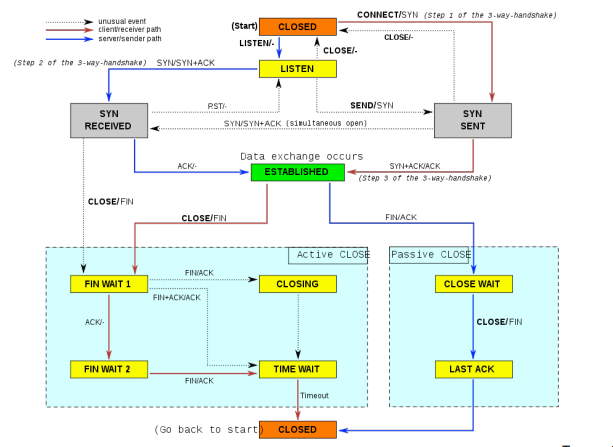

### TCP SYN Attack
- Sending fake SYN packets, to victim's IP address
- Victim will make a TCP connection, allocate buffer, and send SYN+ACK
- ACK never comes back
- After timeout connection state is freed
- To protect:
  - Increase size of connection queue
  - Decrease timeout wait for 3-way handshake
  - Firewalls: list of all known bad IP addresses
  - Better solution: **TCP SYN Cookies**

#### TCP SYN Cookies
- To protect against TCP SYN attack
- Server does not create connection when received a SYN. It only creates ISN, that is a hash of source and destination IP addresses and port number of SYN packet
  - Server sends back SYN+ACK with the ISN
  - Server does not need to store the ISN
- If it was genuine, an ACK will come
  - Generate the ISN
  - Check if ACK is equal to ISN + 1
  - If true, create connection

## 3.6 Principles of congestion control
- **Congestion**: too many sources sending too much data too fast for network to handle
- Congestion causes
  - Increase delivery latency
  - Increase loss rate
  - Increase unnecessary retransmission
  - Wastes capacity of the traffic that is never delivered
  - Increase congestion and cycles continue

### Cost of congestion
- **Knee**: after this point, the throughput increases slowly, but the delay increases fast
- **Cliff**: after this point, throughput starts to drop to zero (congestion collapse), and delay approaches infinity  
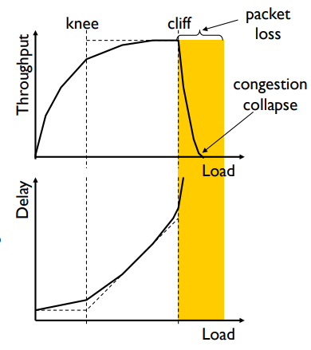

### Approaches towards congestion control
- End-to-end congestion control
  - No explicit feedback from network
  - Congestion inferred from end-system observed loss, delay
  - Approach taken by TCP
- Network-assisted congestion control
  - Routers provide feedback to end-systems
  - Single bit indicating congestion
  - Explicit rate for sender to send

### TCP congestion control
- TCP uses window to controls number of packets in flight
  - TCP sending rate  
  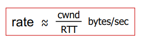
- TCP window types
  - CWND - Congestion window
    - How many bytes can be sent without overflowing routers
    - Computed by the sender using congestion control algorithm
  - RWND - Advertised window, Flow control window
    - How many bytes can be sent without overflowing receiver's buffers
    - Determined by the receiver and reported to the sender
  - Sender side window = min{CWND, RWND}

#### Detecting Congestion
- Packet delays - tricky because the network maybe just busy
- Routers tell end hosts when they are congested - this method requires explicit feedback
- Packet loss - Fail-safe signal that TCP already need to detect

#### Not all losses are the same
- Duplicate ACKs - isolated loss, network just incapable of sneding some segments
- Timeout - more serious, must have suffered several losses

#### Rate Adjustment
- Basic structure:
  - When we receive ACK: increase rate
  - When we loss packet: decrease rate
- How we increase/decrease the rate depends on the phase we're in:
  - Discovering available bottleneck bandwidth
  - Adjusting to bandwidth variations

#### Bandwidth Discovering with Slow Start (SS)
- Goal: estimate available bandwidth
  - Start slow, for safety
  - Ramp up quickly, for efficiency

#### TCP Slow Start
- Increase rate exponentially until first loss event
  - Initially cwnd = 1 MSS
  - Double cwnd every RTT
- Initial rate is slow but ramp up exponentially fast
- Slow start gave an estimate of available bandwidth
- Congestion Avoidancee (CA)
  - Repeated probing (rate increase) and backoff (rate decrease)

#### Additive Increase Multiplicative Decrease (AIMD)
- Additive increase: increase cwnd by 1 MSS every RTT until loss detected
  - cwnd = cwnd + 1 for each successful RTT
  - or cwnd = cwnd + 1/cwnd
- Multiplicative decrease: cut cwnd in half after loss
- TCP "sawtooth"  
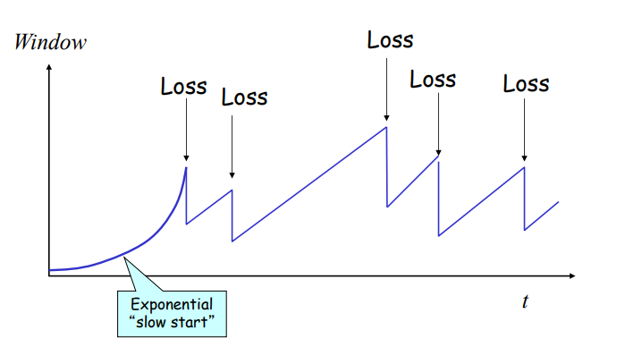

#### Implementation
- State at sender
  - cwnd initialised to small constant
  - ssthresh initialised to large constant
- Events
  - ACK (new data)
    - If cwnd < ssthresh
      - Increase cwnd by 1
    - Else
      - cwnd = cwnd + 1/cwnd
  - Duplicate ACK
    - ssthresh = cwnd/2
    - cwnd = cwnd/2
  - Timeout
    - ssthresh = cwnd/2
    - cwnd = 1

#### TCP Flavours

Flavour|on triple dup ACK|on timeout
-|-|-
TCP-Tahoe|cwnd = 1|cwnd = 1
TCP-Renoe|cwnd = cwnd/2|cwnd = 1

## 3.7 TCP Fairness
- Fairness goal: if K TCP sessions share the same bottleneck link of bandwidth R, each should have average rate of R/K
- 4 alternatives
  - AIAD - gentle increase, gentle decrease
    - Does not converge to fairness
  - AIMD - gentle increase, drastic decrease
    - Converges to fairness
  - MIAD - drastic increase, gentle decrease
  - MIMD - drastic increase, drastic decrease
- Simple model of congestion control  
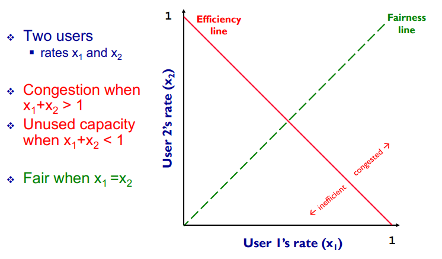

### Implications of TCP Throughput
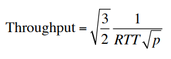  
#### 1. Different RTT
- Flows get throughput inversely proportional to RTT
- TCP unfair with different RTT

#### 2. Loss not due to congestion
- TCP confuses corruption with congestion
- Flow will cut its rate

#### 3. How do short flows fare?
- Short flows never leave slow start
- Too few packets to trigger duplicate ACKs

#### 4. TCP fills up queues, long delays
- A flow deliberately overshoots capacity until it experiences a drop
- Means that delays are large for everyone

#### 5. Cheating
1. Increasing cwnd faster than 1 MSS per RTT
2. Openning many connections
3. Using large initial cwnd
