# COMP3331 - Topic 4: Network Layer - Data Plane

## 4.1 Overview of Network layer

### Internetworking
- Routers forwards packets from source to destination
- Use a common Internet Protocol

### Task of the Network Layer
- Transport segments from sending to receiving host
- On sending side encapsulates segments into datagrams
- On receiving side, delivers segments to transport layer
- Network layer protocols in every host, router
- Router examines header fields in all IP datagrams passing through it

### Two key function
- Forwarding
  - Move packets from router's input to appropriate router output
  - Analogous to getting through single interchange
- Routing
  - Determine route taken by packets from source to destination
  - Using routing algorithms
  - Analogous to planning a trip from source to destination

#### Interplay between routing and forwarding
- **Routing algorithm**: determines end-to-end path through network
- **Forwarding table**: determines local forwarding at this router

### Data vs Control Plane
#### Data Plane
- Local, per-router function
- Detemines how datagram arriving on router input port is forwarded to router output port
- Forwarding function

#### Control Plane
- Network-wide logic
- Determines how datagram is routed among routers along end-to-end path from source host to destination host
- Two control-plane approaches
  - Traditional routing algorithm: individual routing algorithm components in each router    
  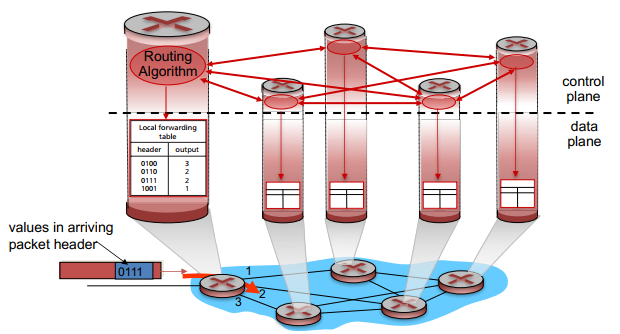
  - Software-defined networking (SDN): a distinct controller interacts with local control agents  
  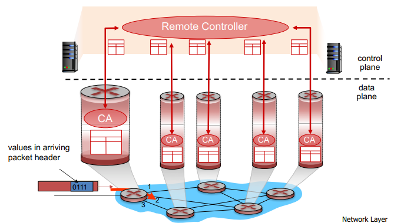

### Service Model
- Example services for individual datagrams
  - Guaranteed delivery
  - Guaranteed deliivery with less than 40msec delay
- Example services for a flow of datagrams
  - In-order datagram delivery
  - Guaranteed minimum bandwidth to flow
  - Restrictions on changes in inter-packet spacing

## 4.2 What's inside a router
### High Level View of Router
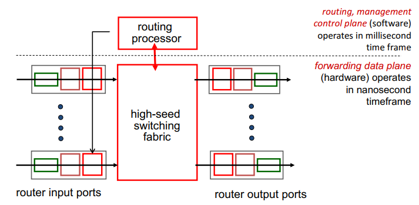

#### Input Port Function
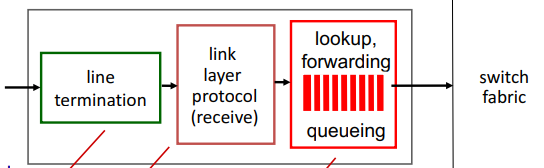
- Physical layer: bit-level reception
- Data link layer: Ethernet
- Decentralised switching
  - Using header field values, lookup output port from forwarding table in input port memory
  - Goal: complete input port processing at "line speed"
  - If processing is slower than the rate that information arrived then will need queueing
  - Destination-based forwarding: forward based on destination IP address
  - Generalized forwarding: forward based on any header field values

### Longest prefix matching
- Use the entry with longest address prefix that matches the destination address when looking at the forwarding table for a given destination address
- Often performed using ternary content addressable memories (TCAMs)
- There are 2^32 combination, so about 4 billion entries and not feasible to search for that much in nanoseconds
- If ranges don't divide up nicely means more fragmentation, larger table, longer lookup

#### Buffering
- If we have N flows, then the buffering equals to  
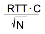

### Scheduling Mechanisms
- Scheduling: choose next packet to send on link

#### FIFO Scheduling
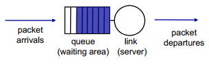
- Send in order of arrival to queue
- Discard policy:
  - Tail drop: drop arriving packet
  - Priority: drop/remove on priority basis
  - Random: drop/remove randomly

#### Priority Scheduling
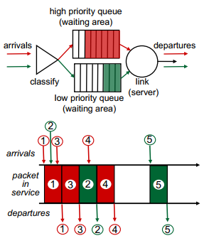
- Send highest priority queued packet
- Multiple classes, with different priorities
- Class may depend on marking or other header info
- Can have starvation for lower priority packet

#### Round Robin Scheduling
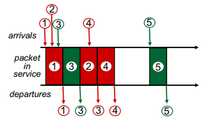
- Multiple classes
- Cyclically scan class queues, sending one complete packet from each class (if available)
- Each class has its own queue

#### Weighted Fair Queueing (WFQ)
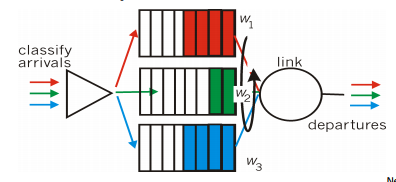
- Generalized Round Robin
- Each class gets weighted amount of service in each classes

### The Internet network layer
- Routing Protocols
  - Path selection
  - RIP, OSPF, BGP
- IP Protocol
  - Addressing conventions
  - Datagram format
  - Packet handling conventions
- ICMP Protocol
  - Error reporting
  - Router "signalling"

## 4.3 IP: Internet Protocol
### IP Packet Structure
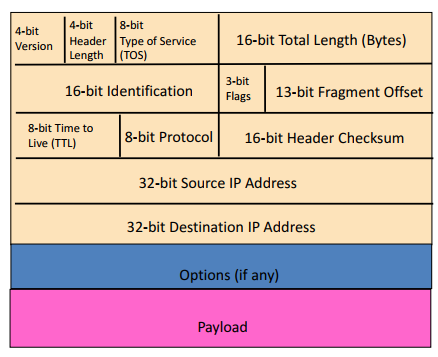
- 20 bytes of standard header
- Fields for reading packet correctly:
  - 4-bit version
    - Indicates the version of the IP Protocol
    - 4 for IPv4 and 6 for IPv6
    - Need to know what other fields to expect
  - 4-bit header length
    - Number of 32-bit words in the header
    - Typically "5" for a 20-byte IPv4 header
    - Can be more if IP options are used
  - 16-bit total length (in bytes)
    - Number of bytes in the packet
    - Maximum size is 65,535 (2^16 - 1)
- Fields for reaching destination and back:
  - 32-bit Source IP address
  - 32-bit Destination IP address
- Telling end-host how to handle packet
  - 8-bit protocol
    - Identifies the higher level protocol
    - Important for demultiplexing at receiving host
    - Eg. 6 for TCP, 17 for UDP
- Special Handling
  - "Type of Service" or "Differentiated Services Code Point" (DSCP) (8 bits)
      - Allow packets to be treated differently based on needs
      - Eg. low delay for audio, high bandwidth for bulk transfer
  - Options

### Potential Problems:
#### 1. Header Corruption (checksum)
- Checksum (16 bits): particular form of checksum over packet header
- If not correct, router discards packets, so it doesn't act on bogus information
- Checksum recalculateed at every router
  - Because TTL changes at every router
  - Not on content because needs to calculate quickly

#### 2. Preventing Loops (TTL)
- Forwarding loops cause packets to cycle for a long time
- Time-to-Live (TTL) field (8 bits)
  - Decremented at each hop, packet discarded if reaches 0
  - "time exceeded" message is sent to the source

#### 3. IP Fragmentation and Reassembly
- Network links have MTU - largest possible link-level frame
- Different link types have different MTUs
- Large IP datagram divided ("fragmented") within net
  - One datagram becomes serveral datagrams
  - "reassembled" only at final destination
  - IP header bits used to identify, order related fragments
- Example  
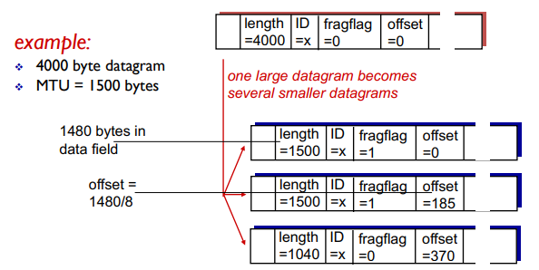

### IP Fragmentation Attack
- IP fragment ovelapped
- IP fragmentation buffer full
- IP fragment overrun
- IP fragment overwrite
- IP fragment too many datagrams
- IP fragment incomplete datagram
- IP fragment too small

### IPv4 Addressing
#### Introduction
- IP address: 32-bit identifier for host, router interface
- Interface: connection between host/router and physical link
  - Roouter's usually have multiple interfaces
  - Host typically has one or two (ethernet and wireless 802.11)
- IP addresses associated with each interface

#### Subnets
- IP address:
  - High order bits - subnet part
  - Low order bits - host part
- Subnet: device interfaces with same subnet part of IP address
  - Can physically reach each other without intervening router
- To determine the subnets, detach each interface from its host or router, creating islands of isolated networks
- Each isolated network is called a subnet

#### Addressing
##### "Classful" Addressing
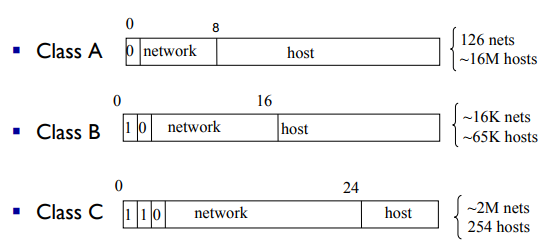
  - A thing from the past

##### Classless InterDomain Routing (CIDR)
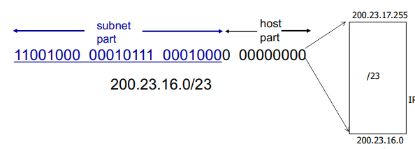
  - The addressing we use now
  - Subnet portion of address of arbitrary length
  - Address format: a.b.c.d/x, x is the number of bits in subnet portion of address

#### Subnet Address
- Subnet mask: used in conjunction with the network address to indicate how many higher order bits are used for the network part of the address (bit-wise AND)
  - Eg. 223.1.1.0/24 is equivalent to 223.1.1.0 with subnet mask 255.255.255.0
- 2 reserved address:
  - Broadcast address: all 111's
  - Subnet address: all 000's

#### How a host get an IP address
- Hard coded by sistem admin in a file
- DHCP: dynamically get address from a server, plug-and-play

### DHCP: Dynamic Host Configuration Protocol
- Goal: allow host to dynamically obtain its IP address from network server when it joins network
- Can renew its lease on address in use
- Allows reuse of addresses (only hold address while connected)
- Support for mobile users who want to join network
- Overview:
  - Host broadcasts "DHCP discover" message
  - DHCP server responds with "DHCP offer" message
  - Host requests IP address: "DHCP requests" message
  - DHCP server sends address: "DHCP ack" message  
- DHCP server broadcasts the message because there might be more than 1 server, so they know the client already got a server

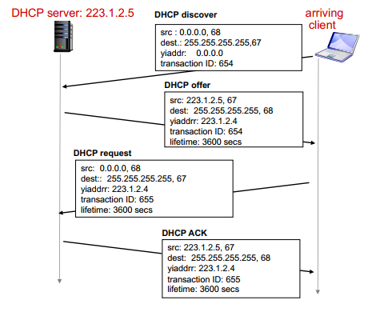

- DHCP can return more than just allocated IP address on subnet
  - Address of first-hop router for client
  - Name and IP address of DNS server
  - Network mask (indicating network versus host portion of address)
- DHCP uses UDP and port numbers 67 (server side) and 68 (client side)
- Ususally the MAC address is used to identify clients
- DHCP offer message includes IP addr, length of lease, subnet mask, DNS servers, default gateway
- Security holes:
  - DoS attack by exhausting pool of IP addresses
  - Masquerading as a DHCP server
  - Authentication for DHCP

#### How a network get subnet part of IP address
- Gets allocated portion of its provider ISP's address space
- CIDR: addresses allocated in contiguous prefix chunks
  - Recursively break down chunks as get closer to host

#### Hierarchical Addressing
- Allows efficient advertisement of routing information
- Example: if an organisation decides to switch ISP
  - Store the mapping on the internet
  - Routers in the Internet will have 2 entries in their table

#### How an ISP get block of addresses
- Internet Corporation for Assigned Names and Numbers (ICANN) allocates addresses and manages DNS

### Network Address Translation (NAT)
- Private addresses
  - Defined in RFC1918:
    - 10.0.0.0/8 (16,777,216 hosts)
    - 172.16.0.0/12 (1,048,576 hosts)
    - 192.168.0.0/16 (65,536 hosts)
  - Addresses that cannot be routed
    - Anyone can use them, typically used for NAT

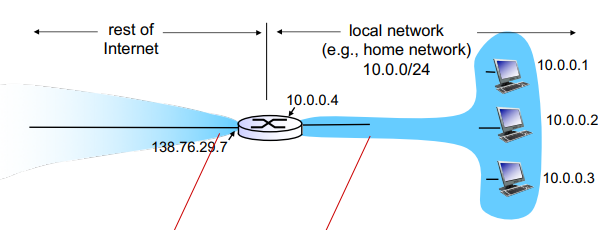
- All datagrams leaving local network have same single source NAT IP address, but different source port numbers
- Datagrams between the Router and Hosts have the same address (10.0.0.0/24)
- NAT router must:
  - Replace the (source IP address, port #) of every outgoing datagram to (NAT IP addr, new port #)
  - Create a NAT translation table to map every (source IP address, port #) to (NAT IP addr, new port #)
  - Replace (NAT IP address, new port #) in every incoming datagram to the corresponding (source IP addr, port #) stored in NAT table
- Advantages
  - Local network uses just one IP address as far as outside world is concerned
  - Can change addresses of devices in local network without notifying outside world
  - Can change ISP without changing addresses of devices in local network
- NAT is controversial:
  - Routers should only process up to layer 3
  - Violates end-to-end argument
    - App designers must take account of NAT, eg in P2P applications
  - Address shortage should instead be solved by IPv6
- Practical issues
  - Needs to recaulculate TCP and IP checksum because it modifies port# and IP addr
  - Some appplications embed IP address or port numbers in their message payloads

### IPv6
- Initial motivation: 32-bit address space soon to be completely allocated
- Additional motivation
  - Header format helps speed processing/forwarding
  - Header changes to facilitate QoS

#### IPv6 Datagram format
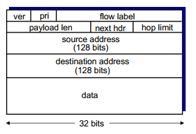
- Priority: identify priority among datagrams in flow
- Flow label: identify datagrams in same "flow"
- Next header: identify upper layer protocol for data
- Difference from IPv4:
  - Checksum removed entirely to reduce processing time
  - Options allowed but outside of header
  - ICMPv6: new version of ICMP
    - Additional message types, eg "Packet Too Big"
    - Multicast group management functions
- Transitioning from IPv4 to IPv6
  - Carry IPv6 datagram as payload in IPv4 datagram among IPv4 routers  
    
  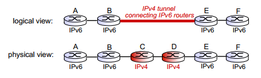

### Virtual Circuit Network
#### Datagram Networks
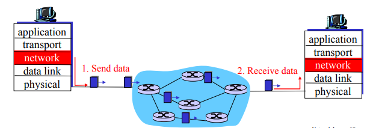
- No call setup at network layer
- Routers: no state about end-to-end connections
  - No network-level concept of "connections"
- Packets forwarded using destination host address

#### Signaling Protocols
- Protocol:
  1. Source initiate call
  2. Destination receive incoming call
  3. Destination accept call
  4. Source notified call connected
  5. Source starts data flow
  6. Destination receives data
- Used to setup, maintain, teardown VC
- Used in ATM
- Not used in today's Internet

#### Implementation
- A VC consists of
  1. Path from source to destination
  2. VC numbers, one number for each link along the path
  3. Entries in forwarding tables in switches along path
- Packet belonging to a VC contains a VC number
- VC number may be changed on each link
- So the forwarding table is for interface and VC #

#### Setting Up a VC
- Source hosts sends a setup message containing the destination address
- All immediate routers
  - Chooses an unused VC# as the incoming VC#
  - Determine the outgoing interface
  - Forward the setup message to the next hop
- When the setup message reaches the destination
  - The destination chooses an available VC#
- The intermediate routers
  - Completes the VC table entry
  - Sends acknowledgement of connection setup upstream
