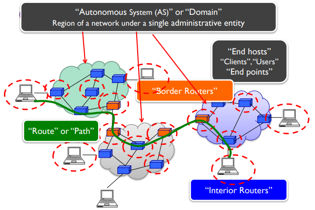
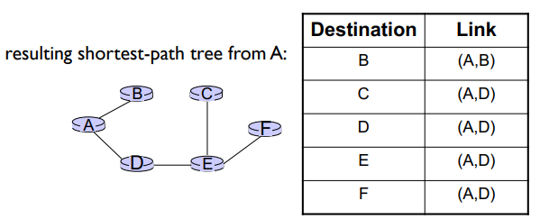
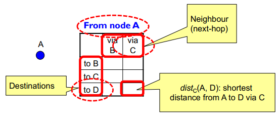

# COMP3331 - Topic 5: Network Layer - Control Plane

## 5.1 Introduction
- Traditional routing algorithms
- Internet Control Message Protocol (ICMP)
- So the routing function of the network-layer is the control plane
- Forwarding is data plane
- Two approaches to structuring network control plane:
  - Per-router control
  - Logically centralized control (SDN)

## 5.2 Routing protocols

- Internet routing works at 2 levels
- Each AS runs an intra-domain routing protocol that establishes routes within its domain
  - Link State, eg. Open Shortest Path First (OSPF)
  - Distance Vector, eg. Routing INformation Protocol (RIP)
- ASes participate in an inter-domain routing protocol that establishes routes between domains
  - Path Vector, eg. Border Gateway Protocol (BGP)

### Graph Abstraction
- N - routers
- E - links
- c - costs
- Routing algorithm: algorithm that finds that least cost path
- Link cost typically simple, all links are equal, then the least-cost paths is shortest path (just the hop count)

### Link State (Global)
- Routers maintain cost of each link in the network
  - Has a list of its directly attached links and their costs
- Connectivity/cost changes flooded to all routers
  - When receiving a new LS message, a router forwards the message to all its neighbours other than the one it received the message from
  - Routers transmit Link State Advertisement (LSA)
    - Keep a copy locally, don't forward previously-seen LSAs
    - Challenges: packet loss, out of order arrival
    - Solutions: Acknowledgement, retransmission, sequence numbers, TTL for each packet
- Converges quickly (less inconsistency, looping)
  - Each node learns the entire network topology eventually
  - Can use Dijkstra's to compute the shortest paths between nodes
- Issues
  - Scalability
    - Needs O(NxE) messages to flood
    - Complexity for Dijkstra is O(N^2)
    - If using min-heap can be O(N log(N) + E)
    - Entries in the LS topology is O(E)
    - Entries in the forwarding table is O(N)
  - Transient Disruptions
    - Inconsistent link-state database
    -  Some routers know about failuer before others
    - The shortest paths are non longer consistent
    - Can cause transient forwarding loops

#### Dijkstra's
- Net topology, link costs known to all nodes
- After k iterations, know at least cost path to k destinations
- Dijkstra's algorithm
  - Initialization:
    - N' = {u}
    - for all nodes v
      - if v adjacent to u
        - then D(v) = c(u,v)
      - else
        - D(v) = ∞
  - Loop
    - Find w not in N' such that D(w) is a minimum
      - add w to N'
      - update D(v) for all v adjacent to w and not in N'
        - D(v) = min (D(v), D(w) + c(w,v))
    - until all nodes in N'

#### Forwarding Table

### Distance Vector (Decentralised)
- Routers maintain its shortest distance to every destination via **each** of its neighbours  

- How it works:
  - Each router initialise the table to ∞
  - And then calculaate the distance based on its immediate neighbours and link costs
  - Each router sends its DV to its immediate neighbours
- Each local iteration caused by:
  - Local link cost change
  - DV update message from neighbour
- Distributed: each node notifies neighbours only when DV changes
- Each node:
  - wait for change in local link cost or msg from neighbour
  - recompute estimates
  - If DV to any dest has changed, notify neighbours
- "Good news travels fast, bad news travels slow"
- Connectivity/cost changes iteratively propagate from neighbour to neighbour
- Requires multiple rounds to converge
- Scales to large network

#### The "Poisoned Reverse" Rule
- Heuristic to avoid count-to-infinity
- If B routes via C to get to A:
  - B tells C that B's distance to A is infinite

### Hierarchical Routing
- Scale: with 600 million destinations
  - Can't sstore all destinations in routing tables
  - Routing table exchange would swamp links
- Administrative autonomy:
  - Internet: network of networks
  - Each network admin may want to control routing in its own network
- Aggregate routers into regions, AS
- Routers in same AS run same routing protocol
  - Intra-AS routing protocol
- Gateway router: at edge of its own AS, and has a link to router in another AS

#### Autonomous Systems (AS)
- AS is a network under a single administrative control
- AS are sometimes called "domain"
- Each AS has a unique identifier, 16-bit AS Number (ASN)
- Interconnected ASes needs to learn each other's ASes

## 5.6 ICMP: The Internet Control Message Protocol
- ICMP is used by hosts and routers to communicate network-level information such as error reporting and ping
- Network layer but "above" IP
  - ICMP messages carried in IP datagrams
