# COMP3331 - Topic 6: Link Layer

## 6.1 Introduction and Services
### Introduction
- Data-link layer has responsibility of transferring datagram from one node to physically adjacent node over a link
- Datagram transferred by different linkn protocols over different links (eg Ethernet and then WiFi)
- Link layer is implemented in each and every host
- Link layer implemented in "adaptor" (aka Network Interface Card (NIC))
- Attachehs into host's system buses
- Combination of hardware, software, firmware

### Link Layer Services
- Framing, link access:
  - Encapsulates datagram into frame, add header
  - Channel access if shared medium
  - "MAC" address used in frame headers to identify source, dest
- Reliable delivery between adjacent nodes
  - Seldom used on low bit-error link
  - Wireless links have higher error rates
- Flow control
  - Pacing between adjacent sending and receiving nodes
- Error detection
  - Errors caused by signal attenuation, noise
  - Receiver detects presence of errors, signals sender for retransmission or drops frame
- Error correction
  - Receiver identifies and corrects bit errors without resorting retransmission
- Half duplex and full duplex
  - With half duplex, nodes at both ends of link can transmit, but not at same time

#### Adaptors Communicating
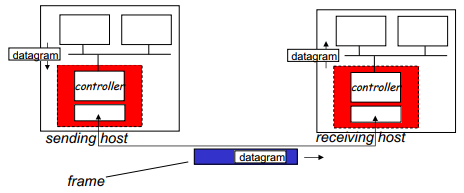
- Sending side:
  - Encapsulates datagram in frame
  - Adds error checking bits, rdt, flow control, etc
- Receiving side:
  - Looks for erros, rdt, flow control, etc
  - Extracts datagram, passes to upper layer at receiving side

## 6.2 Error Detection and Correction
- Error detection is not 100% reliable, the protocol may rarely miss some error

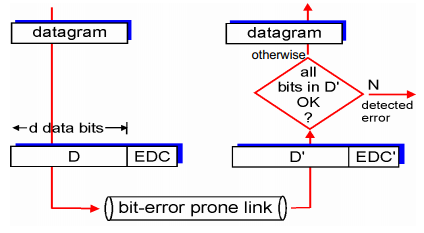
- EDC = Error Detection and Correction bits
- D = Data protected by error checking

### Simple Parity
- Sender
  - Can add a parity bit for every d bits
    - 1 if the number of one's is odd
    - 0 if the number of one's is even
- Receiver
  - For each block of size d:
    - Count the number of 1's
    - Compare with the following parity bit
  - If an odd number of bits get flipped, we can detect it

### Two-Dimensional Parity
- Parity bit for each row and collumn
- Can detect which bit is flipped

### Cyclic Redundancy Check (CRC)
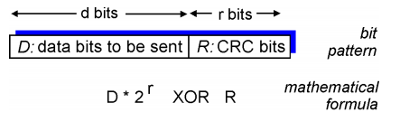
- View data bits, D, as a binary number
- choose r+1 bit pattern (generator), G
- Goal: choose r CRC bits, R, such that
  - <D,R> exactly divisible by G (modulo 2)
  - Receiver know G, divide <D,R> by G
  - If non-zero remainder: error detected
  - Can detect all burst errors less than r+1 bits
- Widely used in practice

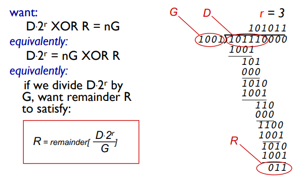

- Notes on modulo-2 Arithmetic
  - Addition, subtraction, and XOR are identical
  - Multiplication with multiples of 2 are just left shift

## 6.3 Multiple Access Protocols
- 2 types of "links"
  - Point-to-point
    - PPP for dial-up access
    - Point-to-point link between Ethernet switch, host
  - Broadcast
    - Old-fashioned Ethernet
    - 802.11 wireless LAN
- Single shared broadcast channel
- Two or more simultaneous transmission by nodes can cause interference
- Multiple access protocol:
  - Distributed algorithm that determines how nodes share channel, to determine when node can transmit
  - Communication about channel sharing must use channel itself

### An ideal multiple access protocol
- Given: broadcast channel of rate R bps
- Desired:
  1. When one node wants to transmit, it can send at rate R
  2. When M nodes want to transmit, each can send at average rate R/M
  3. Fully Decentralised
    - No special node to coordinate transmissions
    - No synchronization of clocks, slots
  4. Simple

### MAC Protocols
- 3 broad classes:
  1. Channel partitioning
    - Divide channel into smaller "pieces" (time slots, frequency, code)
    - Allocate piece to node for exclusive use
  2. Random access
    - Channel not divided, allow collisions
    - "recover" from collisions
  3. "taking turns"
    - Nodes take turns, but nodes with more to send can take longer turns

#### Channel Partitioning MAC protocols
##### TDMA: Time Division Multiple Access
- Access to channel in "rounds"
- Each station gets fixed length slot (length = pkt trans time) in each round
- Unused slots go idle
- Example: 6-station LAN with some slots idle  
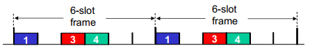

#### FDMA: Frequency Division Multiple Access
- Channel spectrum divided into frequency bands
- Each station assigned fixed frequency band
- Unused transmission time in frequency bands go idle
- Example: 6-station LAN with some slots idle  
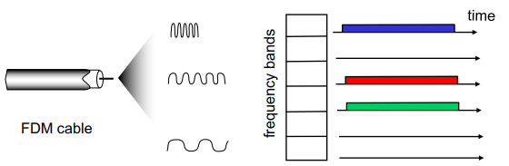

#### Random Access Protocols
- When node has packet to send
  - Transmit at full channel data rate R
  - No a priori coordination among nodes
- Two or more transmitting nodes means collision
- Random access MAC Protocol specifies:
  - How to detect collisions
  - How to recover from collisions
- Examples of random access MAC protocols:
  - slotted ALOHA
  - ALOHA
  - CSMA, CSMA/CD, CSMA/CA

### Slotted ALOHA
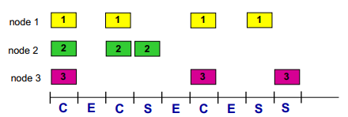
- Assumption:
  - All frames have the same size
  - Time divided into equal size slots (time to transmit per frame)
  - Nodes start to transmit only slot beginning
  - Nodes are synchronized
  - If 2 or more nodes transmit in slot, all nodes detect collision
- Operation:
  - When node obtains fresh frame, transmit in next slot
  - If no collision: node can send new frame in next slot
  - If collision: node retransmit frame in each subsequent slot with prob p until success
- Pros
  - Single active node can continuously transmit at full rate of channel
  - Highly decentralised: only slots in nodes need to be in sync
  - Simple
- Cons
  - Collisions, wasting slots
  - Idle slots
  - Nodes may be able to detect collision in less than time to transmit packet
  - Clock synchronization
- Efficiency
  - Long-run fraction of successful slots
  - Probability that given node has success in a slot = p(1-p)^{N-1}
  - Probability that any node has a success = Np(1-p)^{N-1}
  - Max Efficiency: find p* that maximizes Np(1-p)^{N-1}
  - For many nodes, take limit of Np*(1 - p*)^{N-1} as N goes to infinity, gives
    - Max Efficiency = 1/e = 0.37

### Pure ALOHA
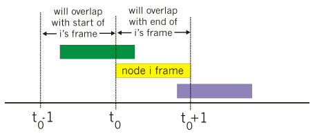
- Simpler, no synchronization
- When frame first arrives, transmit immediately
- Collision Probability increases
  - Frame sent at t_0 collides with other frames sent in [t_0 - 1, t_0 + 1]
- Efficiency is only 18%

### Carrier Sense Multiple Access (CSMA)
- Listen before transmit:
  - If channel sensed idle: transmit entire frame
  - If channel sensed busy: defer transmission
- Does not eliminate collisions because of nonzero propagation delay

#### CSMA Collisions
- Propagation delay means two nodes may not hear each other's transmission
- Collision still wastes time and slot

### CSMA/Collision Detection (CD)
- Carrier snesing, deferral as in CSMA
- Collisions detected within short time
- Colliding transmission aborted, reducing channel wastage
- Collision detection:
  - Easy in wired LANs:
    - Measure signal strengths, compare transmitted, received signals
  - Difficult in wireless LANs:
    - Received signal strength overwhelemed by local transmission strength

#### Algorithm
1. NIC receives datagram from network layer, creates frame
2. If NIC senses channel idle, starts frame transmission. If NIC senses channel busy, waits until channel idle, then transmits
3. If NIC transmits entire frame without detecting another transmission, NIC is done with frame
4. If NIC detects another transmissioin while transmitting, aborts and sends jam signal
5. After aborting, NIC enters binary (exponential) backoff:
  - After m-th collision, NIC chooses K at random from {0, 1, 2, ..., 2^m - 1}. NIC waits K x 512 bit times, return to Step 2
  - Longer backoff interval with more collisions

### "Taking turns" MAC Protocols
- Channel partitioning MAC protocols
  - Share channel efficiently and fairly at high load
  - Inefficient at low load: delay in channel access, 1/N bandwidth allocated even if only 1 active node
- Random access MAC protocols
  - Efficient at low load: single node can fully utilize channel
  - High load: collision overhead
- "Taking turrns" protocols - llok for best of both worlds

#### Polling
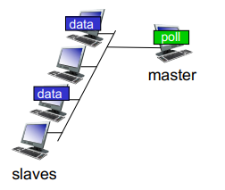
- Master node "invites" slaave nodes to transmit in turn
- Typically used with "dumn" slave devices
- Concerns:
  - Polling overhead
  - Latency
  - Single point of failure (master)

#### Token Passing
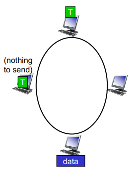
- Control **token** passed from one node to next sequentially
- Token message
- Concerns:
  - Token overhead
  - Latency
  - Single point of failure (token)

## 6.4 Local Area Network (LAN)
### Addressing
#### MAC Address
- Function: used "locally" to get frame from one interface to another physically-connected interface (same network, in IP-addressing sense)
- 48 bit MAC address burned in NIC ROM
- eg: 1A-2F-BB-76-09-AD
- Represented in hexadecimal

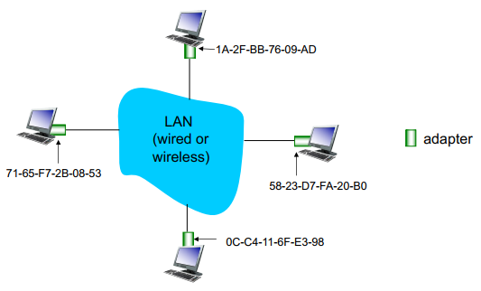
- Each adapter on LAN has unique LAN address
- MAC address allocation administered by IEEE
- Manufacturer buys portion of MACA address space
- MAC address is flat

#### Address Resolution Protocol (ARP)
- ARP Table: each IP node (host, router) on LAN has table
  - IP/MAC address mappings for some LAN nodes
  - TTL: time after which address mapping will be forgotten (around 20 mins)
- If a destination MAC address is not in ARP table, will make a broadcast ARP query packet with destination's IP address
  - The dest MAC address: FF-FF-FF-FF-FF-FF
  - All nodes on LAN receive the query
- When the destination receives the ARP packet, replies with its MAC address
- The source caches IP-to-MAC address pair in its ARP table until it times out
- ARP is "plug-and-play"
- If routing to another LAN
  - Will know destination is not local from Subnet Mask
  - And the router will also store to ARP table when destination found

##### Security Issues: ARP Cache Poisoning
- Denial of Service - Hacker replies back to an ARP query with fake MAC address
- Man in the middle attack - Hacker can insert his machine along the path
- **Solutions**:
  - Monitor ARP traffic
  - Switched ethernet

### Ethernet
#### Physical Topology
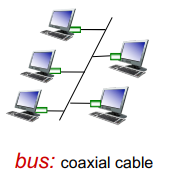
- Bus - popular through the mid 90s
- All nodes in same collision domain (can collide with each other)
- CSMA/CD for media access control  

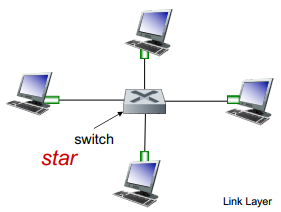
- Star - prevails today
- Active switch in the center
- Each "spoke" runs a (separate) Ethernet protocol
- Nodes do not collide with each other
- No sharing, no CSMA/CD

#### Ethernet Frame Structure

- Sending adapter encapsulates IP datagram (or other network layer protocol packet) in Ethernet frame
- **Preamble**
  - 7 bytes with pattern 10101010 followed by one byte with pattern 10101011
  - Used to synchronize receiver, sender clock rates
- **Addresses**
  - 6 bytes source, destination MAC addresses
  - If adapter receives frame with matcihng destination address, or with broadcast address, it passes data in frame to network layer protocol
  - Otherwise, adapter discards frame
- **Type**
  - Indicates higher layer protocol
- CRC
  - If error is detected, then frame is dropped

#### More on Ethernet
- **Connectionless**
  - No handshaking between sending and receiving NICs
- **Unreliable**
  - Receiving NIC doesn't send acks or nacks to sending NIC
  - Data in dropped frames recovered only if initial sender uses higher layer rdt (eg TCP), otherwise dropped data is lost
- Ethernet's MAC protocol: unslotted CSMA/CD with binary backoff
- 802.3: Many different Ethernet standards:
  - Common MAC protocol and frame format
  - Different speeds: 2Mbps to like 100Gbps
  - Different physical layer media: fiber, cable

### Switches
#### Ethernet Switch
- Link-layer device: takes an active role
  - Store, forward Ethernet frames
  - Examine incoming frame's MAC address, selectively forward frame to one-or-more outgoing links when frame is to be forwarded on segment, uses CSMA/CD to access segment
- Transparent
  - Hosts are unaware of presence of switches
- Plug-and-play, self-learning
  - Switches do not need to be configured
- Multiple simultaneous transmissions
  - No collision
  - Host have dedicated, direct connection to switch
  - Switches buffer packets
- Each switch has a switch table, each entry:
  - MAC address of host
  - Interface to reach host,
  - Time stamp
  - (looks like routing table)
- **Self-learning**
  - Switch learns which hosts can be reached through interfaces
  - When frame received, switch "learns" the locaation of sender
  - Record the sender/location pair in switch table
- **Frame filtering**
  - When frame received at switch:
    1. Record incoming link, MAC address of sending host
    2. Index switch table using MAC destination address
    3.
      - If entry found for destination
        - If destination on segment from which frame arrived
          - Drop frame
        - Else
          - Forward frame on interface indicated by entry
      - Else
        - Flood

#### Interconnecting Switches
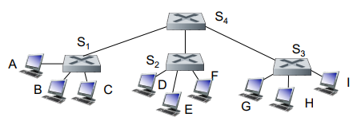

#### Switches vs Routers
- Both are store-and-forward
  - **Routers**: Network layer devices
  - **Switches**: Link-layer devices
- Both have forwarding tables
  - **Routers**: Compute tables using routing algorithm, IP address
  - **Switches**: Learns forwarding table using flooding, learning MAC addresses

#### Security Issues
- In a switched LAN once the switch table entries are established frames are not broadcast
- **Switch Poisoning**: Attacker fills up switch table with bogus entries, when the switch table is full, genuine packets frequently need to be broadcast

## 6.7 A day in the life of a web request
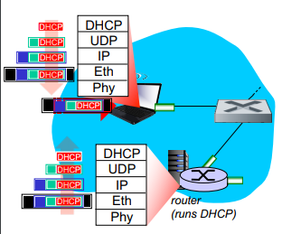
