# COMP3331 - Topic 7: Wireless Network

## 7.1 Introduction
- λ = C/f
- Elements of a wireless network
  - Wireless hosts: devices
  - Base station: cell towers, 802.11 access points
  - Wireless link: used to connect mobile(s) to base station
- Modes in wireless network
  - **Infrastructure mode**: base station connects mobile into wired network
  - **Ad hoc mode**: no base station, nodes can only transmit to other nodes within coverage

## 7.2 Wireless Links, Characteristics
- Important differences from wired link
  - Decreased signal strength
    - Radio signal attenuates as it propagates through matter
  - Interference from other sources
    - Standardized wireless network frequencies shared by other devices
  - Multipath propagation
    - Radio signal reflects off objects ground, arriving at destination at slightly different times
- SNR: signal-to-noise ratio  
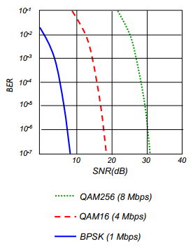
  - Larger SNR means easier to extract signal from noise
  - SNR vs Bit Error Rate (BER)
    - Increase power -> increase SNR -> decrease BER
    - Like if it senses noise, then boost the signal power
    - Wireless card will adapt the modulation scheme based on noise
- Hidden terminal problem  
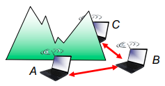
  - B,A and B,C, but not A,C
  - Carrier sense will be ineffective
- Signal attenuation
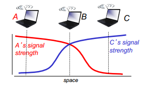
  - B,A and B,C but not A,C
  - A,C might interfere at B
- Exposed terminals
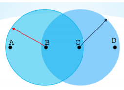
  - B wants to send to A and C wants to send to D at the same time
  - C decided not to send because heard B is transmitting
  - Althought they would not interfere

### Path Loss/Path Attenuation
- Free Space Path Loss (FSPA)
  - FSPA = (4πd/λ)^2
- Reflection, diffraction, absorption
- Terrain contours
- Humidity

### Multipath Effects
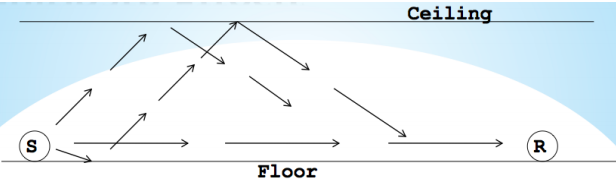
- Signals bounce off surface and interfere

### Code Division Multiple Access (CDMA)
- Unique "code" assigned to each user
- All users share same frequency, but each user has own "chipping" sequence to encode data
- Encoded signal = (original data) X (chipping sequence)  
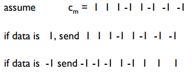
- Decoding: inner-product of encoded signal and chipping sequence
  - If inner product > threshold, the data is 1, else -1

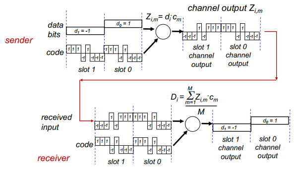

- Interference

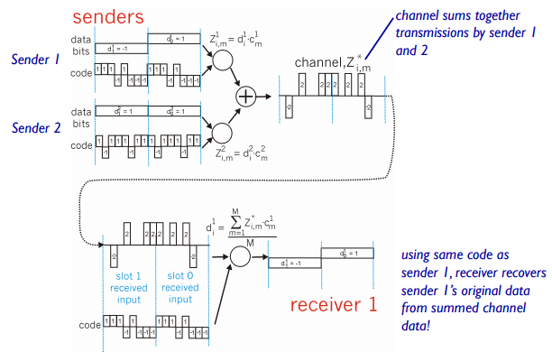

#### CDMA Codes
- CDMA codes are orthogonal
- Inner product of codes should be zero
- If there are multiple CDMA codes, all of the codes have to be orthogonal to each other

## 7.3 IEEE 802.11 Wireless LAN
### Architecture
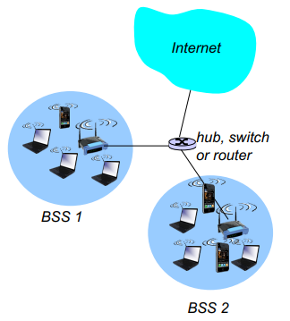
- Wireless host communicates with base station
- Basic Service Set (BSS) or a "cell" in infrastructure mode contains:
  - Wireless hosts
  - Access Point (AP): ase station
  - Ad hoc mode: hosts only

### Channels, Association
- 802.11b: 2.4GHz-2.485Ghz soectrum divided into 11 channels at different frequencies
  - AP admin chooses frequency for AP
- Host must associate with an IP
  - Scans channels, listening for beacon frames containing AP's name (SSID) and MAC address
  - Select AP to associate with
  - May perform authentication
  - Will typically run DHCP to get IP address in AP's subnet

### Passive/Active Scanning
#### Passive Scanning
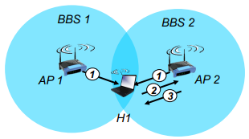
1. Beacon frames sent from APs
2. Association request frame sent from H1 to selected AP
3. Association response frame sent from AP to H1

#### Active Scanning
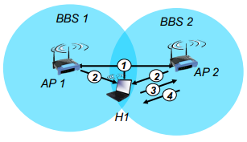
1. Probe request frame broadcast from H1
2. Probe response frames sent from APs
3. Association request frame sent: H1 to selected AP
4. Association response frame sent from AP to H1

### Multiple Access
- No concept of a global collision
  - Different receivers hear different signals
  - Different senders reach different receivers
- Collisions are at receiver, not sender
  - Only care if receiver can hear the sender clearly
  - It does not matter if sender can hear someone else
  - As long as that signal does not interfere with receiver
- Goal of protocol
  - Detect if receiver can hear sender
  - Tell senders who might interfere with receiver to shut up

### MAC Protocol: CSMA/CA
#### Sender
1. If sense channel idle for DIFS then
    - Transmit entire frame
2. If sense channel busy then
    - Start random backoff time
    - Timer counts down while channel idle
    - Transmit when timer expires
    - If no ACK, increase random backoff interval, repeat 2

#### Receiver
- If frame received OK
  - Return ACK after SIFS

#### Avoiding Collisions
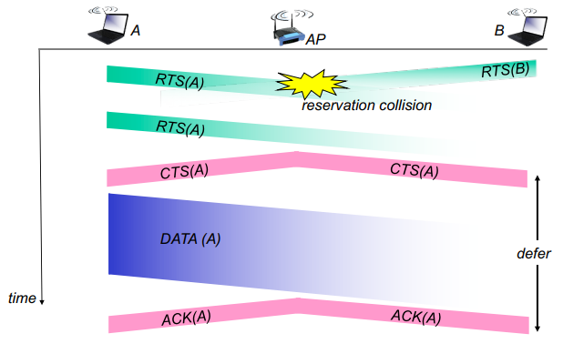
- Sender first transmits small request-to-sent (RTS) packets
- BS broadcasts clear-to-send CTS in response to RTS
- CTS heard by all nodes

### 802.11 Frame: Addressing
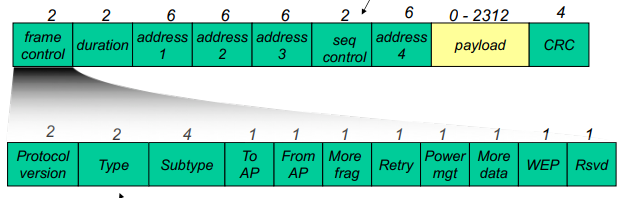
- **Address 1**: MAC address of wireless host or AP to receive this frame
- **Address 2**: MAC address of wireless host or AP transmitting this frame
- **Address 3**: MAC address of router interface to which AP is attached
- **Address 4**: used only in ad hoc mode
- **Duration**: reserved transmission time for RTS/CTS
- **Type**: Frame type (RTS, CTS, ACK, data)
- **Seq control**: frame seq# for RDT

### Advanced Capabilities
#### Rate Adaptation
- Base station, mobile dynamically change transmission rate as mobile moves, SNR varies

#### Power Management
- Node can sleep until next beacon frame
- AP knows not to transmit frames to this node
- Node wakes up before next beacon frame
- Beacon frame: contains list of mobiles with AP-to-mobile frames waiting to be sent
  - Node will stay awake if AP-to-mobile frames to be sent

### 802.15: Personal Area Network
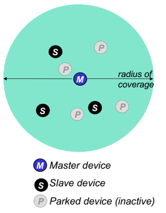
- Less than 10m diameter
- For wireless devices like mouse, keyboard, headphoness
- Ad hoc, no infrastructure
- Master/slaves: slaves request permission to send to master, and master grants the requests
