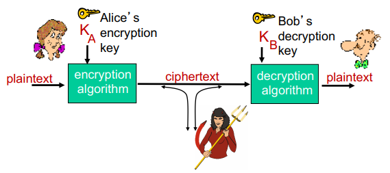
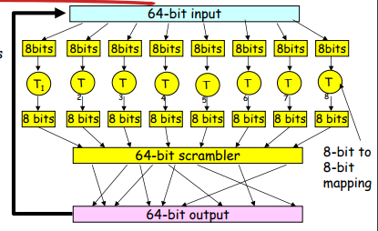
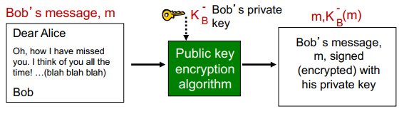

# COMP3331 - Topic 8: Network Security

## 8.1 What is Network Security?
- Confidentiality
  - Only sender and intended receiver should "understand" message contents
- Authentication
  - Sender, receiver want to confirm identity of each other
- Message Integrity
  - Sender, receiver want to ensure message not altered (in transit, or afterwards) without detection
- Access and Availability
  - Services must be accessible and available to users

### Bad Guys Can
- Intercept messages
- Actively insert messages into connection
- Spoof source address in packet
- Hijacking: "take over" ongoing connection by removing sender/receiver, inserting himself in place
- Denial of service: prevent service from being used by others

## 8.2 Principles of Cryptography

- m - plaintext message
- K_a - key A

### Symmetric Key Cryptography
- Receiver and sender share same key
- Example: substitution cipher

#### Breaking an encryption scheme
- Cipher-text only attack
  - Has cipher text she can analyze
  - Can brute force or do statistical analysis
- Known-plaintext attack
  - Has plaintext corresponding to ciphertext
- Chosen-plaintext attack
  - Can get ciphertext for chosen plaintext

### Symmetric Ciphers
  - Stream ciphers: encrypt one bit at a time
  - Block ciphers: break plaintext message in equal-size blocks, encrypt each block as a unit  
  

### Public Key Cryptography

## 8.3 Message Integrity
### Digital Signatures

## 8.4 Authentication
- Goal: Bob wants Alice to "prove" her identity to him

### ap1.0
- Alice says "I am alice"

### ap2.0
- Alice says "I am alice" in an IP packet containing her source IP address

### ap3.0
- ALice says "I am Alice" and sends her secret password to "prove it"

### ap3.1
- Alice says "I am Alice" ande sends her encrypted secret password to "prove" it

### ap4.0
- To prove Alice "live", Bob sends Alice nonce, R. Alice must return R, encrypted with shared secret key

### ap5.0
- Use nonce, public key cryptography
